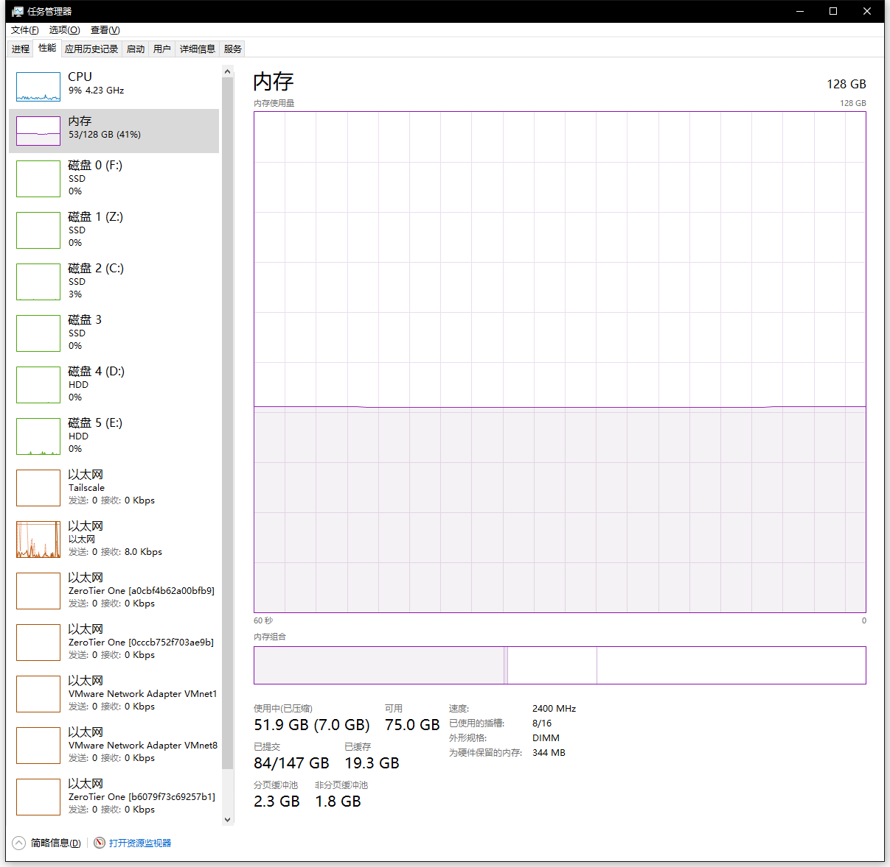

简单介绍windows任务管理器的内存标签
---------------------------------

by @karminski-牙医

## 使用中

当前使用的内存总量

## 已压缩

使用中被压缩的量 （windows 10 中引入的技术, 可以压缩一部分内存, 但仍然驻留在内存中。相比swap, 性能会好一些）

## 已缓存（Cached）

通常指的是 页面缓存（Page Cache），这是操作系统用于 缓存文件数据 的内存区域。具体来说，它是存储从磁盘读取到内存的文件内容，目的是加快文件系统的读取速度。

## 已提交（Committed）

是指操作系统已经 承诺 分配的内存总量，这些内存可以是实际分配给应用程序的内存，也可以是操作系统保留用于内核缓存或其他用途的内存。已提交内存的量通常大于实际使用的内存量，因为它包括了系统为应用程序分配但尚未使用的内存（通过 懒加载 等技术）。一旦系统内存不足，操作系统会将部分已提交内存的内容写入磁盘。

## 分页缓冲池（Paged Pool）

是操作系统为内核分配的一部分 虚拟内存，用于存储可分页的内核数据结构和对象。这些数据结构可以在内存和磁盘之间交换，因此称为 分页缓冲池。

## 非分页缓冲池（Non-paged Pool）

操作系统为内核分配的另一部分内存，它与分页缓冲池不同之处在于，非分页缓冲池中的数据不会被交换到磁盘。这些数据必须始终保留在物理内存中，因为系统需要快速、稳定地访问这些内存区域，且不能在内存不足时通过分页交换到磁盘。
