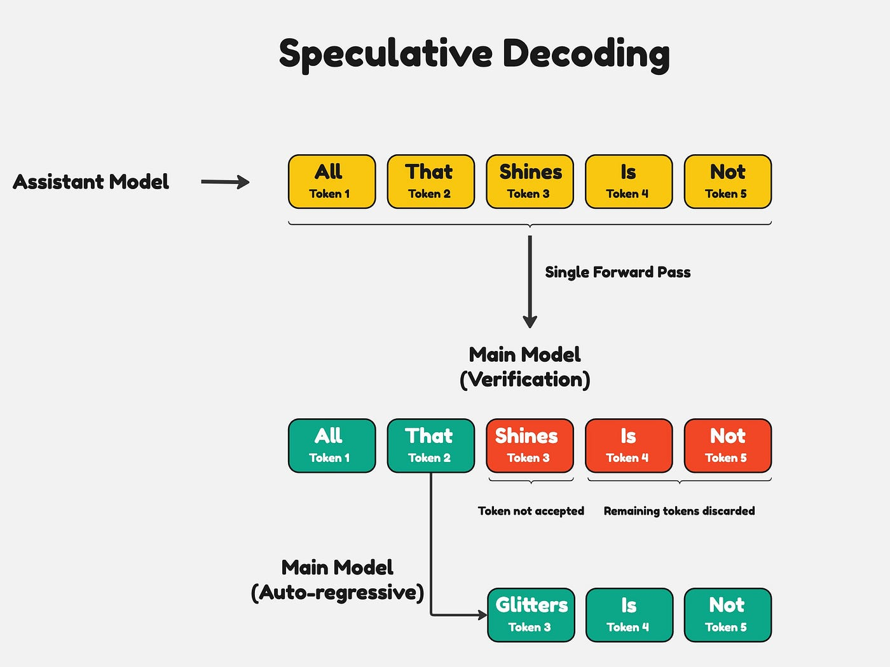

什么是推测性解码
--------------

by @karminski-牙医

推测性解码是一种用于优化大语言模型推理性能的技术。它的核心思想是：在当前大模型生成当前 token 的同时，使用小的草稿模型对未来的 token 进行预测。

## 工作原理

**双模型结构**：
   - 主模型（Target Model）：完整的大语言模型，精度高但速度较慢
   - 草稿模型（Draft Model）：较小的模型，速度快但精度较低

**多头预测**：
   - 在模型中添加多个预测头（speculative heads）
   - 每个预测头负责预测未来的一个 token（N+1, N+2, N+3...）
   - 可以在单次前向传播中预测多个 token
   - 使用较小的草稿模型快速预测多个可能的后续 token
   - 草稿模型通常是主模型的蒸馏版本或更小的变体

**验证机制**：
   - 主模型会验证草稿模型预测的 token 序列
   - 如果预测正确，就可以直接使用
   - 如果预测错误，则回退到主模型重新生成

## 性能提升

根据文章报告的数据：
- 语言模型可获得约 2 倍的速度提升
- 代码模型可获得约 3 倍的速度提升

## 实现考虑

**模型选择**：
   - 草稿模型通常是主模型的 1/4 到 1/2 大小
   - 例如：如果主模型是 70B 参数，草稿模型可能是 7B 或 13B 参数

**预测头数量**：
   - 语言模型通常使用 3-4 个预测头
   - 代码模型可以使用 6-8 个预测头

**效率平衡**：
   - 需要在计算量、内存使用和预测准确性之间找到平衡
   - 预测头数量增加会带来额外计算开销
   - 但如果预测准确，可以减少内存访问次数

这项技术的主要优势在于它能显著提升模型的推理速度，同时保证输出质量不受影响。它特别适合需要快速响应的生产环境使用。

## Reference

- [Fast Inference from Transformers via Speculative Decoding](https://ar5iv.labs.arxiv.org/html/2211.17192)
- [Hitchhikers Guide to Speculative Decoding](https://pytorch.org/blog/hitchhikers-guide-speculative-decoding/)
