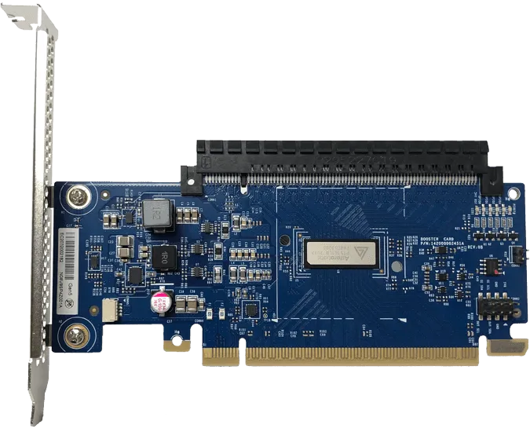

什么是 PCIe Retimer？
--------------------

by @karminski-牙医

(图中的是 Aries PCIe®/CXL® Smart DSP Retimers)

PCIe Retimer 是一种用于改善 PCIe 信号质量的硬件设备。在高速数据传输过程中，信号会因为传输距离、电路板走线等因素出现衰减和失真，Retimer 的作用就是接收这些衰减的信号，进行放大、均衡和重整时序，以恢复信号的完整性和质量，保证数据传输的可靠性。

## 具体来说，PCIe Retimer 的功能包括：

* **时钟恢复 (Clock Recovery) 和重整时序 (Retiming)：** 提取信号中的时钟信息，并根据该时钟信息重新生成新的信号，消除时钟抖动 (Jitter)，保证数据传输的同步性。
* **信号放大 (Amplification)：** 补偿信号在传输过程中的衰减，增强信号强度。
* **信号均衡 (Equalization)：** 补偿信号在高频传输中产生的失真，例如码间干扰 (ISI)。

## PCIe Retimer 的应用场景

* **服务器和数据中心：** 在服务器和数据中心中，需要进行大量高速数据传输，例如连接 CPU、GPU、网卡和存储设备等。由于服务器内部空间有限，电路板走线较长，信号衰减较为严重，因此需要使用 PCIe Retimer 来保证信号质量。
* **存储设备：** 例如 NVMe 固态硬盘 (SSD)，其数据传输速度非常快，对信号质量要求很高，因此一些高端 NVMe SSD 或扩展卡上也会使用 PCIe Retimer。
* **扩展卡和背板：** 为了扩展 PCIe 插槽的数量或连接距离，会使用扩展卡或背板，这些设备通常需要使用 PCIe Retimer 来保证信号质量。

个人目前接触到的 PCIe Retimer 主要用于多卡服务器 (大多都是插多PCIe显卡或SXM显卡用来跑大语言模型的) ，以及一些高端的存储设备 (超大容量的NVMe存储) 。剩下就是垃圾佬自己搓的各种板卡了。

## PCIe Retimer 与 Redriver 的区别：

在 PCIe 信号增强领域，还有一种叫做 Redriver 的器件。Redriver 是一种模拟信号放大器，主要用于补偿信号的衰减，功能相对简单。而 Retimer 则集成了信号放大、均衡和重整时序等功能，功能更加强大，可以更好地恢复信号质量。简单来说，Redriver 就像一个“扩音器”，而 Retimer 则像一个“信号再生器”。

## 总结

PCIe Retimer 是一种重要的信号完整性解决方案，它可以有效提高 PCIe 信号的传输距离和质量，保证高速数据传输的可靠性。但其实这是由于目前各个总线的速度越来越快，导致信号衰减越来越严重，所以需要使用 Retimer 来保证信号质量。目前不但 PCIe 需要 Retimer，其他的设备也有类似的 Retimer 器件，例如DDR CKD (Client Clock Driver ) 。

