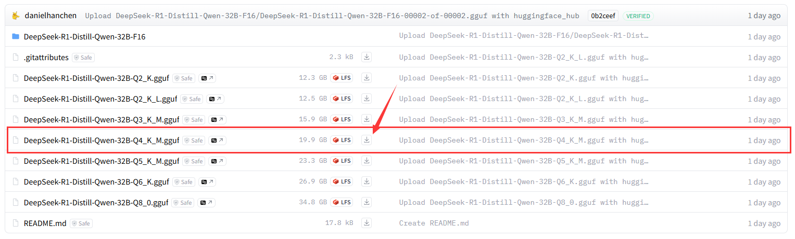
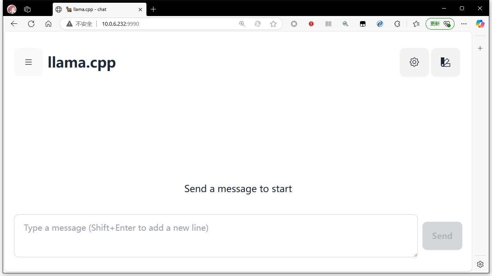

如何本地运行 GGUF 格式的 LLM 模型?
--------------------------------

by @karminski-牙医


本篇内容教大家如何本地运行 GGUF 格式的 LLM 模型. 这里以最新的 DeepSeek-R1-Distill-Qwen-32B-GGUF 模型为例. 


## 模型下载

我比较喜欢 unsloth 团队的量化版本, 所以这里下载的是 unsloth 团队的量化版本. 

下载地址 [https://huggingface.co/unsloth/DeepSeek-R1-Distill-Qwen-32B-GGUF/tree/main](https://huggingface.co/unsloth/DeepSeek-R1-Distill-Qwen-32B-GGUF/tree/main)



注意这个是个合集包, 里面有 Q2-Q8 的量化版本, 选中你喜欢的量化版本, 点击这个下载按钮即可. 不需要全部下载.


## 编译 llama.cpp

由于这个模型比较新 (2025-01-21发布的), 所以需要编译最新的 llama.cpp 才能支持这个模型.

首先下载 llama.cpp 的源码, 然后编译.

```
git clone https://github.com/ggerganov/llama.cpp
cd llama.cpp
cmake -B build
cmake --build build --config Release -j 
```

如果你的电脑没有 cmake, 请自己搜索如何安装 cmake. 问问 LLM 是好方法.


## 模型运行

直接运行编译好的 llama.cpp 即可.

```bash
./build/bin/llama-server -m /data/unslouth/DeepSeek-R1-Distill-Qwen-32B-GGUF/DeepSeek-R1-Distill-Qwen-32B-Q8_0.gguf --host 0.0.0.0 --port 9990
```

## ok 啦~!

在浏览器访问你指定的 IP 和端口, 例如 http://192.168.1.2:9990 即可.




