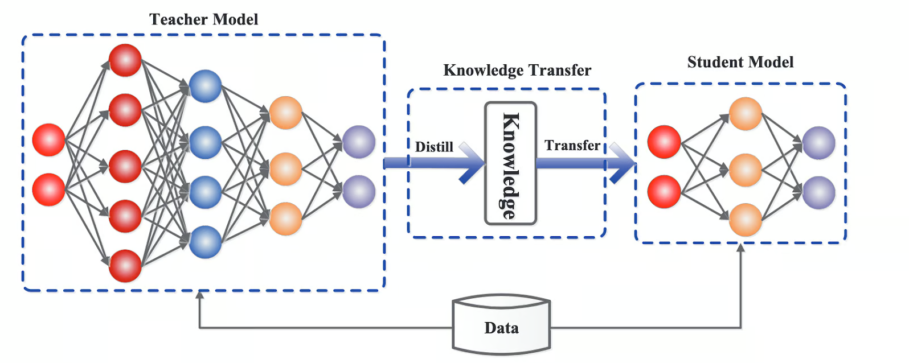

什么是 LLM 蒸馏技术?
-------------------

by @karminski-牙医

LLM 蒸馏 (Distillation) 是一种技术，用于将大型语言模型 (LLM) 的知识转移到较小的模型中。其主要目的是在保持模型性能的同时，减少模型的大小和计算资源需求。通过蒸馏技术，较小的模型可以在推理时更高效地运行，适用于资源受限的环境。

## 蒸馏过程

蒸馏过程通常包括以下几个步骤：
- 训练教师模型：首先训练一个大型且性能优越的教师模型。
- 生成软标签：使用教师模型对训练数据进行预测，生成软目标 (soft targets) ，这些目标包含了教师模型的概率分布信息。
- 训练学生模型：使用软目标 (soft targets) 和原始训练数据 (hard targets) 来训练较小的学生模型，使其能够模仿教师模型的行为。
这种方法不仅可以提高模型的效率，还可以在某些情况下提高模型的泛化能力。

## 蒸馏的优点

- 减少模型大小和计算资源需求
- 增加推理速度
- 易于访问和部署

(其实就是小模型相对于大模型的优点)

## 蒸馏可能存在的问题

- 信息丢失：由于学生模型比教师模型小，可能无法完全捕捉教师模型的所有知识和细节，导致信息丢失。
- 依赖教师模型：学生模型的性能高度依赖于教师模型的质量，如果教师模型本身存在偏差或错误，学生模型可能会继承这些问题。
- 适用性限制：蒸馏技术可能不适用于所有类型的模型或任务，尤其是那些需要高精度和复杂推理的任务。

## 典型例子

- GPT-4o  (教师模型) 中提炼出 GPT-4o-mini  (学生模型) 
- DeepSeek-R1  (教师模型) 中提炼出 DeepSeek-R1-Distill-Qwen-32B  (学生模型) (这个不是传统意义上的蒸馏了, 是蒸馏+数据增强+微调)

## 其他蒸馏技术

- 数据增强: 使用教师模型生成额外的训练数据。通过创建更大、更具包容性的数据集，学生可以接触到更广泛的场景和示例，从而提高其泛化性能。
- 中间层蒸馏: 将知识从教师模型的中间层转移到学生。通过学习这些中间表示，学生可以捕获更详细和结构化的信息，从而获得更好的整体表现。
- 多教师蒸馏: 通过汇总不同教师模型的知识，学生模型可以实现更全面的理解并提高稳健性，因为它整合了不同的观点和见解。

## 题外话

强烈推荐读一下下面引用中的第一个和第二个论文, 里面有详细的蒸馏技术介绍. 第二个论文是 Geoffrey Hinton 写的, 他正式在这篇论文里面首次引入了 soft targets 和 hard targets 的概念.

## Refs

- [Knowledge Distillation: A Survey](https://arxiv.org/pdf/2006.05525)
- [Distilling the Knowledge in a Neural Network](https://arxiv.org/pdf/1503.02531)
- [LLM Distillation Explained: Applications, Implementation & More](https://www.datacamp.com/blog/distillation-llm)
