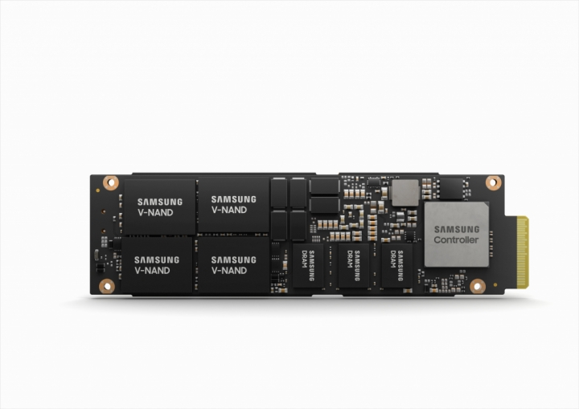
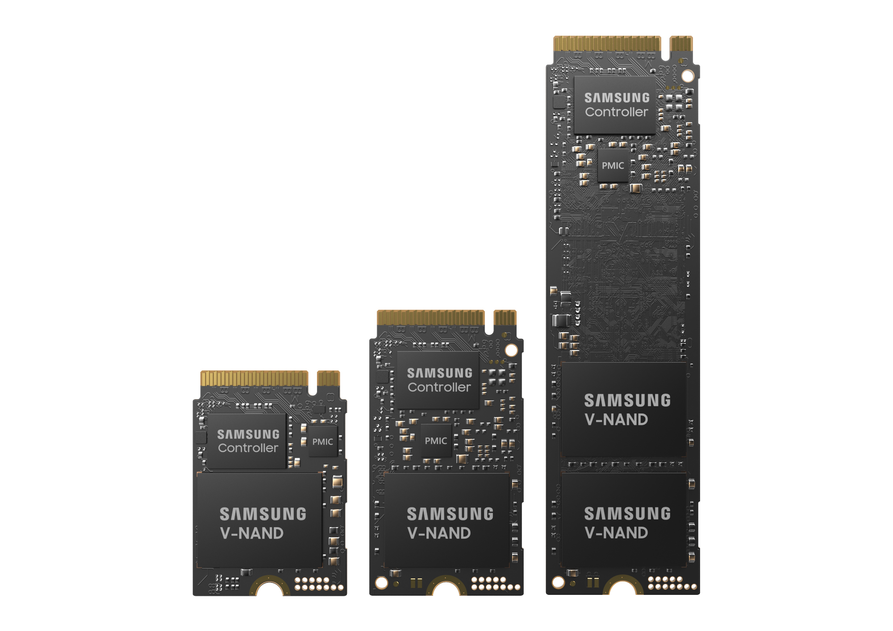

为什么有的 NVMe SSD 有 DRAM, 有的没有?
------------------------------------

by @karminski-牙医

(图片来自 Samsung Newsroom)

有的同学可能会有疑问, SSD 明明是存储器件, 为什么有的 NVMe SSD 有 DRAM, 有的没有? 

如图, 是 samsung 的企业级 NVMe SSD PM9A3, 可以看到它单面就有 3 个 DRAM. 

## NVMe SSD 上的 DRAM 是做什么的？

**数据映射缓存**：DRAM用于存储数据映射表 (也称为Flash Transition Layer) , 帮助控制器快速找到数据的物理位置, 从而提高读写速度. 
   
**读/写缓存和缓冲**：DRAM作为写缓冲区 (由DMA操作), 临时存储即将写入 NAND Flash 的数据, 减少写放大效应, 通过合并写操作提高写入速度. 同时, DRAM也用于存储常用数据 (热数据) , 减少读取延迟. 

**算法运行支持**：DRAM帮助进行垃圾回收和磨损均衡算法的运行, 存储元数据如错误校正码和坏块信息. 

## 有 DRAM 的 SSD 的好处

**性能提升**：由于DRAM的高速缓存功能, SSD的读写速度更快, 特别是在随机读写操作中. 
   
**降低延迟**：DRAM的存在减少了数据访问的延迟, 因为控制器可以快速访问数据映射表. 

**更好的耐久性**：通过减少写放大效应和更有效的磨损均衡, DRAM SSD 的耐久性更好. 

**更高的可靠性**：由于更好的错误校正和缓存机制, DRAM SSD 在高负载场景下更可靠. 

## 有 DRAM 的 SSD 的劣势

**成本较高**：DRAM芯片的成本较高, 因此有DRAM的SSD通常比无DRAM的SSD更贵. 

**功耗增加**：DRAM需要额外的电力来运行, 虽然差异不大, 但在移动设备中可能会影响电池寿命. 

**发热量增加**：DRAM是SSD中主要的发热源之一, 尽管其性能提升值得, 但会导致SSD的整体温度上升. 

## 那么有没有没有 DRAM 的 SSD 吗?

有的, 一些入门级 SSD 比如三星的 PM9C1a 就没有 DRAM. 

这类 SSD 通常使用系统的 RAM 进行缓存 (即 HBM, 主机内存缓冲区) , 但与驱动器自己的 DRAM 相比, 性能会受到影响. 

(图片来自 Samsung Newsroom)

