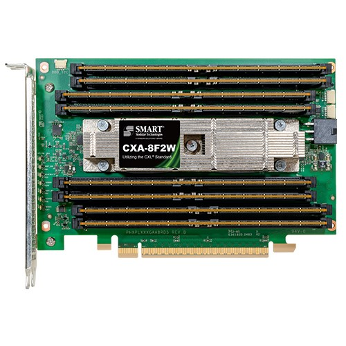
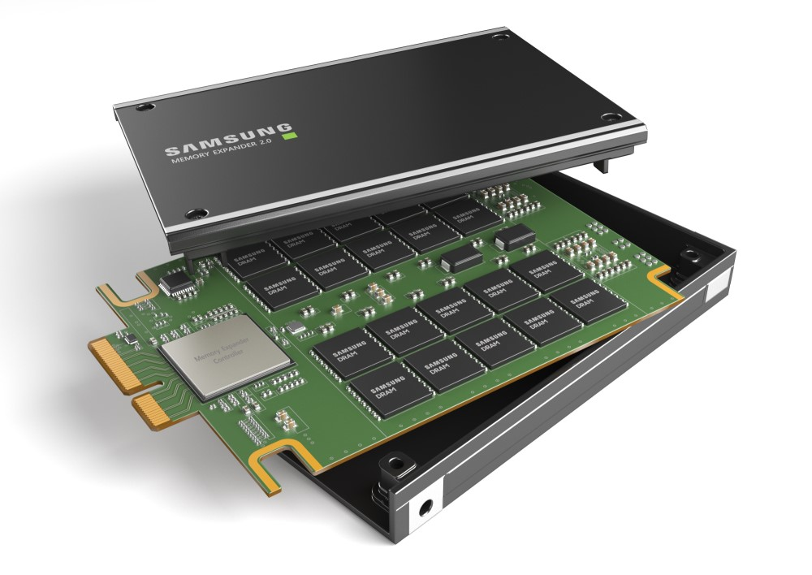
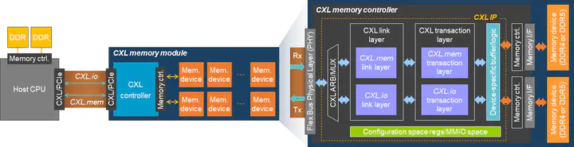

CXL 会是大语言模型的内存解决方案吗?
--------------------------------

by @karminski-牙医

(图片来自 mouser)

Compute Express Link ( CXL ) 是一种开放标准互连, 用于高速, 高容量中央处理单元(CPU) 到设备以及 CPU 到内存连接, 专为高性能数据中心计算机而设计. 

CXL 包括:

- CXL.io: PCIe 的块输入/输出协议
- CXL.cache: 用于访问的新缓存一致性协议系统内存
- CXL.mem: 用于访问的新缓存一致性协议设备内存

今天主要介绍的是, 基于 CXL 的可以插在 PCIe 插槽上的内存设备.

## 简介

其实 CXL 是 intel 牵头搞的, 继 Optane DCPMM 后, intel 对扩展内存的其他方向上的尝试, 后续阿里巴巴, 思科, 戴尔EMC, Meta, 谷歌, HPE, 华为, 微软成立了 CXL联盟.  

后续 Gen-Z联盟（Gen-Z联盟是搞架顶内存的, 机架顶部专门有个FPGA服务器, 这个服务器由FPGA连接一大堆内存给其他服务器用）, OpenCAPI（IBM搞的类似的东西, 给 Power 平台用的）均纳入到了 CXL. 

目前市面上投产的 CXL 2.0 版本是基于 PCIe 5.0, 最大支持8条DDR5内存, 每条最大 512GB, 总容量 4TB (头图). 另外还有 Samsung 基于 E3.s 封装的版本, 但也是 CXL 2.0 (下图).

(图片来自 Samsung Newsroom)

在设备中, CXL内存显示为无CPU-NUMA节点. CXL 协议支持交换, 甚至CXL Fabric之类的光传输方案. 然而, CXL 内存引入了更长的内存访问延迟, 即 CPU-> PCIe控制器 -> CXL控制器 (如下图). 

(图片来自 ipoom-jeong.com)

## 那么能用在 LLM 上吗?

简单回答, 不行. 

虽然目前 CXL 设备在硬往 AI 方向上靠, 但其最大瓶颈仍然是带宽, 目前市面上 CXL 2.0 设备最大带宽是 64GB/s, 而 LLM 动辄 TB级别的带宽需求, 显然是远远不够的.

拿70B级别的模型举例, Q4 量化都达到了 40GB, 想要每秒钟输出 100 token, 需要接近 4TB 的内存带宽. 折合下来, 需要 62 块 CXL 2.0 设备, 这个成本不比直接购买显卡便宜. 

而最新的 CXL 3.1 标准 (注意 CXL 3.0版本目前好像也没投产), 即使支持 PCIe 6.0, x16 也就是 128GB/s 还是太慢了. 按照跑 70B 模型达到 100token/s 计算, 需要大概 31 块 CXL 设备, 每个插 64GB 内存, 插满8条, 总计容量来到了 15TB, 带宽才达到 4TB/s. 导致对于 LLM 场景, 容量过大, 而速度又不够, 容量和速度间过于失衡. 

如果用作训练呢? 比如用作张量卸载等场景? 答案是, 也不太好, 由于远端 NUMA 设备的巨大延迟, 通常都会超过 400ns, 导致张量卸载的效率不佳.

一点优势也没有吗? 不是的, 因为存储容量巨大, 所以 batch size 可以很大, 即可以同时支持更多的用户来请求大模型.

我的结论是, 目前 CXL 内存, 在 LLM 场景下, 还不能作为内存解决方案. 即使理论上可以搭建多机器交换方案, 目前也没看到实际应用的报告. 所以综合衡量成本和风险, 不如直接买显卡.

## Refs

- [CXL 3.1 standard](https://computeexpresslink.org/wp-content/uploads/2024/02/CXL-3.1-Specification.pdf)
- [demystifying-cxl-memory-with-genuine-cxl-ready-systems-and-devices](https://ipoom-jeong.com/publication/demystifying-cxl-memory-with-genuine-cxl-ready-systems-and-devices/)
- [Exploring and Evaluating Real-world CXL: Use Cases and System Adoption](https://arxiv.org/html/2405.14209v1)
