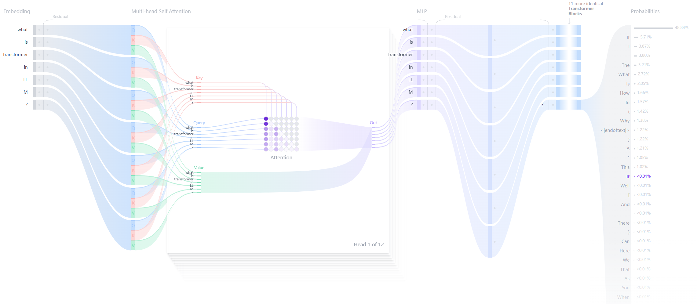

什么是 Transformer?
------------------

by @karminski-牙医

Transformer 是一种用于自然语言处理 (NLP) 的深度学习模型架构, 由 Vaswani 等人在 2017 年提出. 它主要用于处理序列到序列的任务, 如机器翻译, 文本生成等.   

简单来讲, 文本生成的 Transformer 模型的原理是——"预测下一个词".

用户给定的文本 (prompt), 模型会预测下一个词最有可能是什么. Transformer 的核心创新和强大之处在于它使用的自注意力机制（self-attention mechanism）, 这使得它们能够处理整个序列, 并比之前的架构 (RNN) 更有效地捕捉长距离依赖关系. 

另外需要注意的是, GitHub 上的 huggingface/transformers 是 HuggingFace 实现的 Transformer 模型库, 包括了 Transformer 的实现和大量的预训练模型. 

目前的 LLM 基本都基于 Transformer 架构, 并对其进行优化技术和训练方法的改进. 

## Transformer 的结构

每个文本生成 Transformer 都由以下三个关键组件构成：

### **嵌入层（Embedding）**：
   - 文本输入被分割成称为词元（token）的更小单位, 可以是单词或子词
   - 这些词元被转换成称为嵌入（embeddings）的数值向量
   - 这些嵌入向量能够捕捉词语的语义含义

### **Transformer 块**：
   这是模型处理和转换输入数据的基本构建单元. 每个块包括：
   - **注意力机制（Attention Mechanism）**：
     - Transformer 块的核心组件
     - 允许词元之间相互通信
     - 捕捉词语之间的上下文信息和关系
   - **多层感知器（MLP）层**：
     - 一个前馈网络, 独立处理每个词元
     - 注意力层的目标是在词元之间路由信息
     - MLP 的目标是优化每个词元的表示

### **输出概率（Output Probabilities）**：
   - 最终的线性层和 softmax 层
   - 将处理后的嵌入转换为概率
   - 使模型能够预测序列中的下一个词元

## Transformer 的优点：

- **并行化处理**：与 RNN 不同, Transformer 不需要按顺序处理数据, 因此可以更好地利用 GPU 进行并行计算, 提高训练速度. 
- **长距离依赖**：自注意力机制使得 Transformer 能够有效捕捉序列中远距离的依赖关系. 
- **灵活性**：Transformer 可以很容易地扩展到更大的模型 (如BERT、GPT等) , 并在多种 NLP 任务中表现出色. 

## Transformer 的缺点：

- **计算复杂度高**：自注意力机制的计算复杂度为O(n^2), 当输入序列长度较长时, 计算资源消耗较大. 
- **数据需求大**：Transformer 通常需要大量的数据进行训练, 以便充分发挥其性能. 
- **缺乏内在的序列信息**：由于没有内置的序列处理机制 (如 RNN 中的时间步) , 需要额外的机制 (如位置编码) 来引入序列信息. 

## Refs

关于 Transformer 的内容实在是太多, 很难在简单的一篇文章中介绍清楚, 所以本篇其实算是一个索引, 后续我会针对每个技术细节做详细的介绍.

另外本人虽然是从业者, 但更关注 LLM 下游应用, 对 LLM 训练本身经验并不多, 所以如果有任何错误还请大家指出.

这两个引用中, 第一个是关于 transformer 的最经典论文, Attention Is All You Need. 正是这篇论文首次提出了 Transformer.

第二个是关于 transformer 的可视化解释, 可以很直观的看到 transformer 的内部结构.

- [Attention Is All You Need](https://arxiv.org/abs/1706.03762)
- [Transformer Explainer](https://poloclub.github.io/transformer-explainer/)
