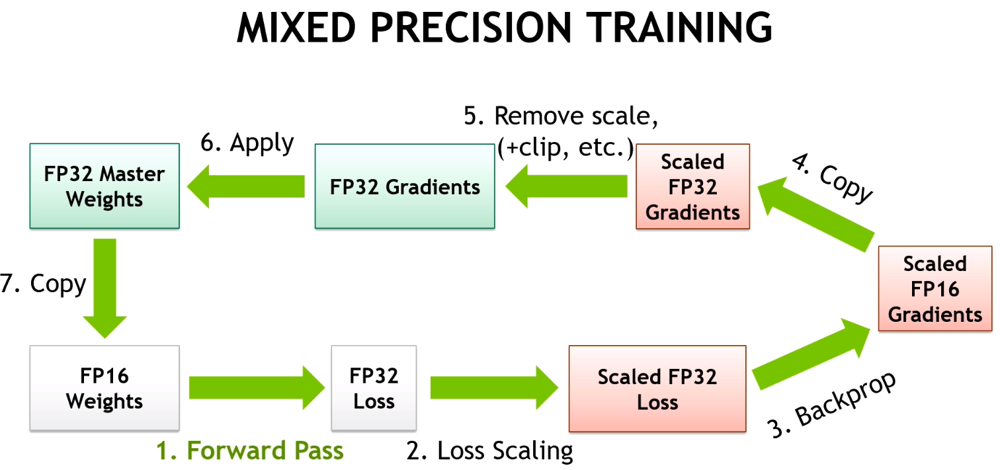

Transformer 的优化方案都有哪些?
-----------------------------

by @karminski-牙医

目前使用 Transformer 架构的模型, 都使用了一些优化方案来达到更好的效果或更高的性能, 所以我整理了常见的优化方案 (包括训练和推理), 后续会详细讲解每个优化方案的技术细节.

### **注意力机制优化**

- **Flash Attention**
  - 减少内存访问和计算复杂度, 显著提升训练和推理速度
  - 被 Llama2, Qwen, PaLM2, Mistral, DeepSeek 等采用
  - 部分闭源模型可能采用类似技术或自研方案

- **Multi-Query Attention (MQA)**
  - 减少 Key 和 Value 的头数, 降低内存使用和计算量
  - 被 PaLM, Falcon, BLOOM 等采用

- **Grouped-Query Attention (GQA)**
  - MQA 的改进版本, 通过分组共享 Key/Value 矩阵（而非完全独立）实现性能和效率的平衡
  - 被 Llama2, PaLM2, Gemini, Mistral, DeepSeek 等采用

### **位置编码优化**

- **RoPE (Rotary Position Embedding)**
  - 通过旋转矩阵实现相对位置编码, 支持更好的长度外推性
  - 被 Llama, DeepSeek, Qwen, Mistral, Falcon, PaLM 等广泛采用
  - 支持 NTK-aware 插值和 Dynamic NTK 等长度扩展方法

- **ALiBi (Attention with Linear Biases)**
  - 线性注意力偏置, 有助于外推到更长序列
  - 被 Bloom, Stable LM 等采用

### **架构优化**

- **并行计算优化**
  - 通过解耦注意力层和前馈层的计算路径，实现：
    1. 减少层间计算依赖，提升计算并行度
    2. 优化内存访问模式，降低显存占用
    3. 提高计算资源利用率（特别是 Tensor Core）
    4. 支持更大 batch size 的训练
  - 典型实现方案：
    - **PaLM 并行结构**：同时计算注意力层和前馈层，结果合并后做残差连接
    - **GPT-3 模型并行**：通过张量/流水线并行实现超大规模模型训练
  - 被 PaLM, GPT-3, T5, Megatron-LM 等模型采用

- **激活函数优化**
  - 使用 SwiGLU 替代标准 FFN 中的激活函数, 提供更好的性能
  - 被 PaLM, Llama2, Gemini, Qwen 等采用

- **稀疏专家模型 (MoE)**
  - 通过多个专家网络实现大规模参数扩展
  - 被 Mixture-of-Experts, Switch Transformer 等采用

### **上下文长度扩展**

- **滑动窗口注意力**
  - 局部注意力机制, 减少内存使用, 支持更长序列处理
  - 被 Longformer, BigBird 等采用

- **稀疏注意力**
  - 只关注重要的 token, 降低计算复杂度, 提高处理长序列的能力
  - 被 Sparse Transformer, Reformer, Longformer 等采用

### **内存优化**

- **参数共享**
  - 跨层参数复用, 减少模型参数量, 降低内存需求
  - 被 ALBERT, T5 等采用

### **训练优化**

- **混合精度训练**
  - FP16/BF16 混合精度训练广泛应用于大模型训练
  - FP8 目前主要用于推理阶段（如 NVIDIA H100）, 但 DeepSeek-V3 使用了 FP8 训练, 带来了巨大的成本优势, 甚至最新的论文还尝试了 FP4 训练
  - 大多数现代大模型使用 BF16 训练

- **梯度检查点**
  - 训练时动态重计算, 节省显存, 略微增加计算时间
  - 被大模型训练普遍采用

### **推理优化**

- **KV Cache**
  - 通过缓存历史 token 的 Key/Value 矩阵实现：
    1. 避免重复计算历史 token 的注意力结果
    2. 减少解码时的计算量（复杂度从 O(n²) 降为 O(n)）
    3. 降低内存带宽需求，提升推理速度
    4. 支持更长的上下文处理
  - 内存管理策略：
    - 预分配固定长度内存
    - 动态扩展机制（如 vLLM 的 PagedAttention）
  - 被 Llama 系列、GPT 系列、PaLM、Gemini、Qwen 等主流模型采用

- **量化技术**
  - INT8/INT4 量化, 减少模型大小和内存占用, 加快推理速度
  - 主流量化方法包括 GPTQ, AWQ 等
  - 支持 per-tensor 和 per-channel 量化粒度
  - 被 LLaMA-2, ChatGLM, Qwen, Mistral, Yi 等采用

- **推理加速技术**
  - 推测解码 (Speculative Decoding)
  - 连续批处理 (Continuous Batching)
  - 动态批处理, 提高 GPU 利用率

### **特定硬件优化**

- **GPU 特化**
  - CUDA 核心优化
  - Tensor Core 利用
  - 显存访问优化
  - 算子融合
  - 内存布局优化

这些优化方案通常会组合使用，不同的模型会根据自己的具体需求选择合适的优化方案。比如：

- **Llama2**: 采用 GQA + RoPE + Flash Attention
- **PaLM2**: 使用 GQA + 并行计算优化
- **Qwen**: 采用 Flash Attention + RoPE

接下来几期我会详细介绍这些优化方案的技术细节, 以及它们在不同模型中的应用.
