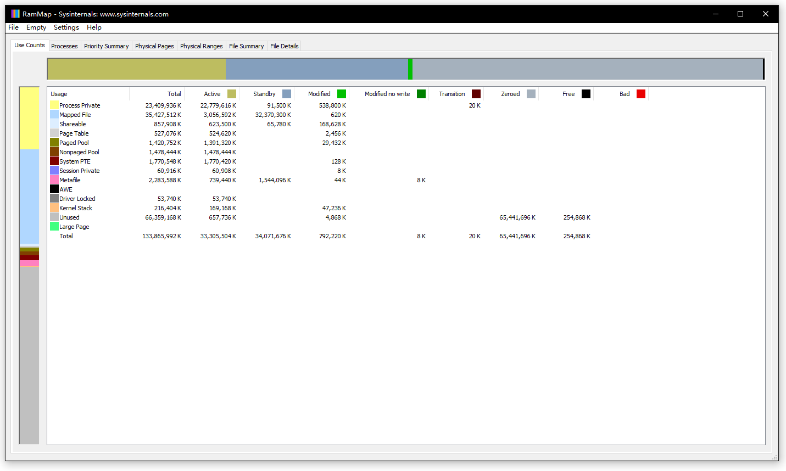

RAMMap 使用解析
--------------

- by @karminski-牙医

RAMMAP 是 Windows Vista 和更高版本的高级物理内存使用分析实用程序.  通过它可以轻松查看 Windows 如何分配物理内存, 在内存中缓存多少文件数据, 或内核和设备驱动程序使用了多少内存. 

## Use Counts 使用情况计数器

我们主要介绍 Use Counts 使用情况计数器, 它显示了每个特定的区域使用了多少内存. 

- Process Private: 进程私有内存, 指由特定进程独占使用的内存空间. 这些内存不能被其他进程访问或共享. 

- Mapped File: 内存映射文件, 由内核缓存管理器（Cache Manager）管理. 将文件内容直接映射到进程的地址空间中. 这通常用于提高文件访问效率, 多个进程可以共享同一个文件的映射（需使用相同映射方式和访问权限）. 

- Shareable: 可共享内存, 是可以被多个进程访问的内存区域. 这包括共享的DLL、COM对象等. 

- Page Table: 页表, 用于管理虚拟内存到物理内存的映射关系的系统数据结构. 它记录了虚拟地址到物理地址的转换信息. 

- Paged Pool: 分页池, 是系统核心组件使用的可被换出到磁盘的内存池. 主要用于存储系统数据结构、I/O请求等. 

- Nonpaged Pool: 非分页池, 是系统核心组件使用的不可被换出到磁盘的内存池. 用于存储必须常驻内存的关键系统数据. 

- System PTE: 系统页表项, 系统用于映射内核空间和系统数据的页表条目资源池. 

- Session Private: 会话私有内存, 与特定用户会话相关的私有内存空间. 主要用于存储用户界面相关的数据. 

- Metafile: 元文件内存, 用于存储系统元数据, 如NTFS文件系统的元数据等. 

- AWE (Address Windowing Extensions): 地址窗口扩展, 允许32位应用程序访问超过4GB的物理内存（在64位系统中已逐渐淘汰, 可以看到我这个机器的截图是0）. 

- Driver Locked: 驱动程序锁定的内存, 被设备驱动程序锁定而不能被换出的内存页面. 

- Kernel Stack: 内核栈, 用于系统内核执行函数调用和存储临时数据的内存空间. 

- Unused: 未使用的物理内存, 当前空闲可用的内存页面. 

- Large Page: 大页面内存, 使用较大的内存页面（通常是2MB或1GB）来减少页表开销, 提高性能. 

- Total: 所有类型内存使用的总和. 

## 如何使用 RAMMap 定位问题?

比如 Metafile 使用量很大, 说明系统正在访问大量的文件, 这可能出现在文件服务器上, 从而导致缓存的 NTFS metafile 数据无法从缓存中释放. 

## Refs

- [RAMMAP 下载地址](https://learn.microsoft.com/en-us/sysinternals/downloads/rammap)
