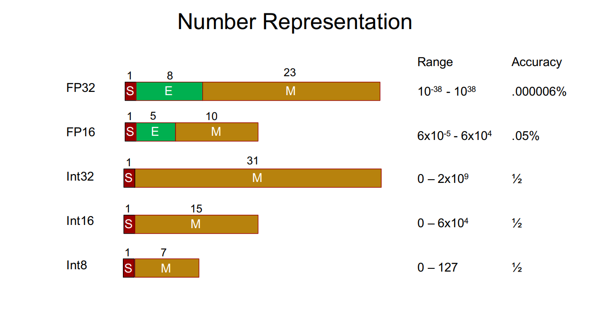

什么是大语言模型量化? 每个量化精度都代表什么?
-----------------------------------------

- by @karminski-牙医

量化 (Quantization) 是一种通过降低模型参数的数值精度来压缩模型大小的技术. 在深度学习中, 模型参数通常以32位浮点数 (FP32) 存储, 通过量化可以将其转换为更低精度的表示形式, 从而减少模型的内存占用和计算开销. 

如图, FP32 的大小是 4 字节 (每个字节8bit, 4字节 * 8bit = 32bit), 而 FP16 的大小是 2 字节 (每个字节8bit, 2字节 * 8bit = 16bit). 

这也是为什么大家喜欢用 Q4 量化模型的原因, 跟 FP16 (16bit) 的模型相比, Q4 (4bit) 的模型只有 1/4 的大小. 运行起来需要的内存也是1/4.

现在大多数模型训练都采用 FP16 的精度, 最近出圈的 DeepSeek-V3 采用了 FP8 精度训练, 能显著提升训练速度和降低硬件成本. 

## Q4_K_M 到底是什么意思?

所以我们大概了解了 Q4 实际上指的是 4bit 量化, 那么后缀都是什么意思呢？ 于是我整理了常见的量化精度和后缀供大家参考：

这种命名方式一般是 GGUF & GGML 格式的模型. 他们通常采用 K 量化模型, 格式类似 Q4_K_M, 这里的 Q 后面的数字代表量化精度, K 代表 K 量化方法, M 代表模型在尺寸和 PPL (Perplexity, 困惑度) 之间的平衡度, 有 0, 1, XS, S, M, L 等. 

PPL 是评估语言模型性能的重要指标, 它用来衡量模型对下一个词的预测准确程度

常见 K 量化版本的PPL对比 (这是一个7B模型): 

| type | ppl increase | ppl 13b to 7b % | file size | note |
| ---- | ------------ | --------------- | --------- | ---- |
| q2_k | 0.8698 | >100% | 2.67GB | 超大号的模型想要测试, 可以考虑 Q2 版本, 比如 unsloth 团队的 DeepSeek-V3-Q2_K_M 量化版本, 我测下来实际感觉是可用的 |
| q4_0 | 0.2499 | 38.3% | 3.5GB |  |
| q4_1 | 0.1846 | 28.3% | 3.9GB |  |
| q4_ks | 0.1149 | 17.6% | 3.56GB |  |
| q4_km | 0.0535 | 8.2% | 3.80GB | 如果没有提供 Q5 量化版本, 那么 Q4 量化版本也可以考虑, 建议至少 Q4_K_M 版本 |
| q5_0 | 0.0796 | 12.2% | 4.3GB |  |
| q5_1 | 0.0415 | 6.36% | 4.7GB |  |
| q5_ks | 0.0353 | 5.41% | 4.33GB |  |
| q5_km | 0.0142 | 2.18% | 4.45GB | 目前我最推荐的量化大小, 实际体验下来各种模型量化中这个版本是最理想的 |
| q6_k | 0.0044 | 0.67% | 5.15GB |  |
| k8_0 | 0.0004 | 0.061% | 6.7GB | 如果您显存十分富裕, 当然推荐这个 |

(数据来自: [llama.cpp PR 1684](https://github.com/ggerganov/llama.cpp/pull/1684))  
(具体全部量化选项可以看 llama.cpp 的源代码 [ggml-quants.h](https://github.com/ggerganov/llama.cpp/blob/a38b884c6c4b0c256583acfaaabdf556c62fabea/ggml/src/ggml-quants.h))

## 那 bf16, 4bit, int4, fp8 这种呢?

这种常见于其它量化格式的模型. 有了上面的经验我们很容易猜出来 bf16 是 16bit 的精度, 4bit 是 4bit 的精度. 同样也建议至少使用 4bit 量化的模型, 除非模型特别大 200B+.
