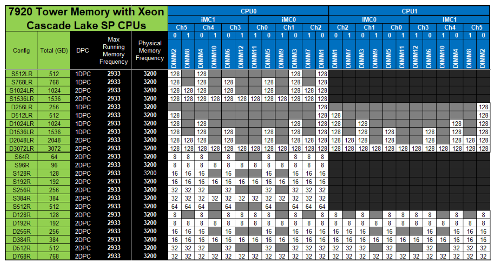
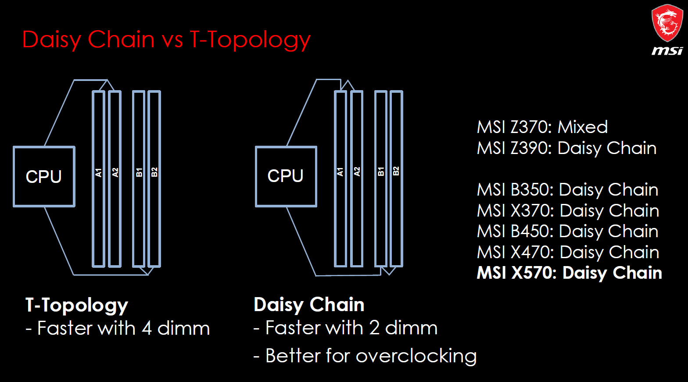

什么是 1DPC? 为什么内存条要插在远端插槽? 
-------------------------------------

- by @karminski-牙医

稍微装过机的同学可能都知道, 内存不能乱插, 否则可能会无法开机. 而有经验的同学会去查一查主板手册, 看看内存插槽的配置. 

如上图, 就是 DELL Precision T7920 工作站的内存插槽配置. 我们可以看到 DPC 这一列做的 1DPC 和 2DPC 的区分. 那么这到底是什么意思呢?

## 1DPC 和 2DPC 是什么?

首先要澄清的是, 2DPC 可不是双通道内存的意思. 简单来讲, 1DPC 是 每个通道一插条内存 (one DIMM per channel) 的缩写. 

现在大多数消费级主板都是双通道, 4个内存插槽. 所以可以推理出来, 1DPC 配置就是每个通道只插一条内存, 或者只在通道1上插1条内存. 而 2DPC 配置则是插满4个内存插槽.

## 为什么 1DPC 配置要插在远离CPU的最外端?

(图片来自 forum-en.msi.com)

现代主板内存布线主要采用两种拓扑结构, Daisy Chain (菊花链) 和 T-Topology (T型拓扑) . 现在高频消费级主板大多采用菊花链拓扑, 而服务器/工作站主板更多使用T型拓扑.

通过图片我们可以看到, 菊花链的拓扑结构, 内存控制器信号的终止节点在最远端. 而 T型拓扑每个内存插槽都是终止节点.

菊花链的优点:
- **信号完整性要求**：当使用1DPC配置时, 内存控制器信号需要直达最远端插槽
- **终端电阻位置**：DDR4/DDR5 规范要求通道末端必须配置终端电阻 (On-Die Termination, 现在已经集成在内存条上了) , 插外侧插槽可确保信号路径阻抗匹配以及减少信号反射

而T型拓扑的缺点有:
- **分支结构缺陷**：当只插1条内存时, 未插内存的分支会产生阻抗突变以及造成信号反射
- **串扰增加**：空置插槽的耦合电容会降低信号质量

可以看到T型拓扑的缺点基本都存在于没插满内存的情况, 所以服务器/工作站主板大多采用T型拓扑(最高配置获得最优性能). 

以上这些全都是为了保证DDR信号在电路中的传输质量, 我们现在使用的内存频率对于电气特性要求非常高, 信号都在ns级别. 只有传输质量上升, 电路才能运行在更高的频率. 

现在的 DDR5-8000 内存对于 1990 年代 386 电脑上的 FPM 内存 (25MHz) 来讲简直是外星科技.

## Refs

强烈建议花时间阅读 MSI 论坛的这篇帖子, 介绍的非常全面.

- [ram-explained-why-two-modules-are-better-than-four-single-vs-dual-rank-stability-testing](https://forum-en.msi.com/index.php?threads/ram-explained-why-two-modules-are-better-than-four-single-vs-dual-rank-stability-testing.363139)
