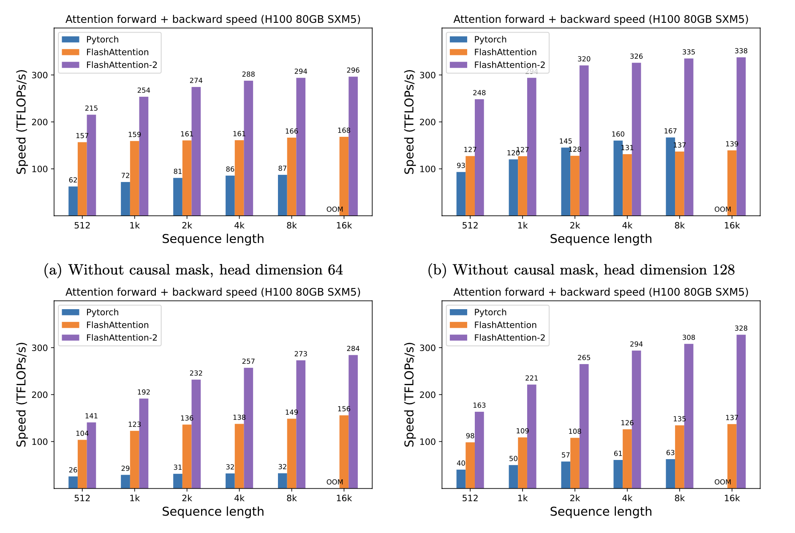

什么是 Flash Attention?
-------------------------

- by @karminski-牙医

Flash Attention 是一种优化的注意力机制, 旨在提高深度学习模型中注意力计算的效率. 它通优化访存机制来加速训练和推理过程. 

目前的GPU架构中, HBM 容量大但处理速度慢, SRAM 虽然容量小但操作速度快. 

标准的注意力机制使用 HBM 来存储、读取和写入注意力分数矩阵（attention score matrix, 矩阵存储 Q/K/V). 具体步骤为将这些从 HBM 加载到 GPU 的片上 SRAM, 然后执行注意力机制的单个步骤, 然后写回 HBM, 并重复此过程. 

而 Flash Attention 则是采用分块计算（Tiling）技术，将大型注意力矩阵划分为多个块（tile），在 SRAM 中逐块执行计算。通过：
- **分块策略**：将 Q/K/V 矩阵分块后流水线处理，避免存储完整的中间矩阵
- **重计算（Recomputation）**：在反向传播时动态重新计算前向结果，而非存储中间值
- **IO优化**：通过精确的内存访问控制，使数据在 HBM 和 SRAM 间的移动最小化

### 优点

- **计算效率高**：通过分块并行计算和半精度（FP16/BF16）优化，充分利用 GPU Tensor Cores
- **内存使用减少**：重计算技术减少 4-20 倍内存占用，支持更长序列训练
- **训练加速**：反向传播通过延迟重计算优化，实现端到端 2-4 倍加速
- **精度保持**：采用平铺分块策略时仍保持数值稳定性，支持混合精度训练

### 缺点

- **实现复杂**：由于需要对底层计算进行优化, Flash Attention 的实现可能比传统注意力机制更复杂. 
- **硬件依赖**：在某些情况下, 可能需要特定的硬件支持才能充分发挥其性能优势. 
- **调试困难**：优化后的计算过程可能导致调试和故障排查变得更加困难. 

总的来说, Flash Attention 是一种强大的工具, 能够在不牺牲性能的情况下提高模型的效率, 但在实现和使用时需要考虑其复杂性和硬件要求. 

## 性能

当使用 H100 显卡且序列长度是512时（数据来自论文测试），PyTorch 的标准处理速度是 62 Tflops，而 Flash Attention 则可以达到 157 Tflops，Flash Attention 2 则可以达到215 Tflops。在 FP16/BF16 精度下，实际加速比可达标准实现的 3-4 倍。

## Refs

- [FlashAttention: Fast and Memory-Efficient Exact Attention with IO-Awareness](https://arxiv.org/abs/2205.14135)
- [flash-attention on github](https://github.com/Dao-AILab/flash-attention)
