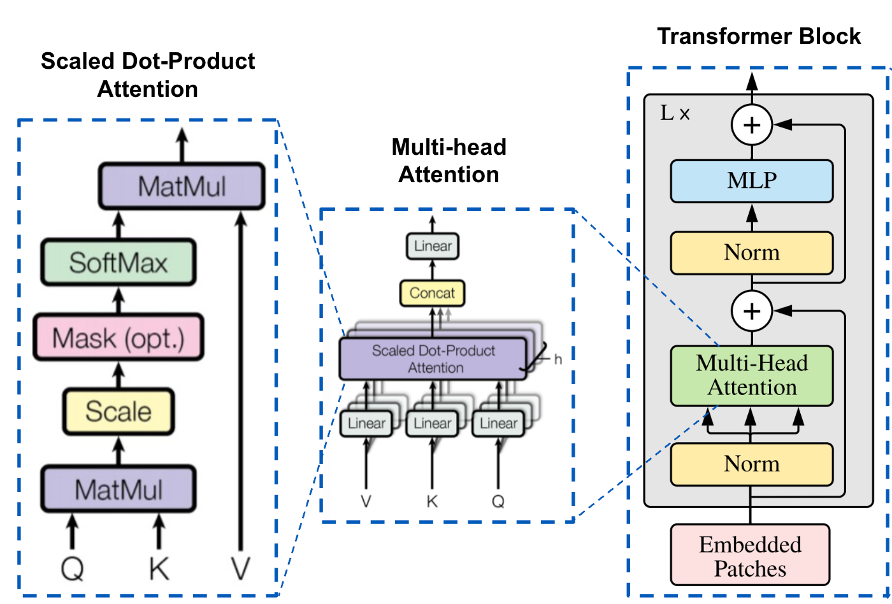

什么是 Multi-Head Attention? 
---------------------------

- by @karminski-牙医

多头注意力（Multi-Head Attention）是 Transformer 架构中的一个核心组件，它通过并行运行多个注意力机制来增强模型的性能。

在多头注意力机制中，"头"是指一个独立的注意力机制。每个头有自己的一组权重，用于计算输入的自注意力。通过使用多个头，模型可以从不同的角度和特征空间中提取信息。

### 工作原理

首先我们来看注意力公式, 给定输入向量 $Q$（查询）、$K$（键）和 $V$（值），注意力机制的计算公式为：

$$
\text{Attention}(Q, K, V) = \text{softmax}\left(\frac{QK^T}{\sqrt{d_k}}\right)V
$$

其中，$d_k$ 是$K$ (键) 向量的维度。

多头注意力则将上面的公式拆分, 通过多个独立的注意力头来增强模型的能力。每个头有自己的查询、键和值的线性变换。公式如下：

$$
\text{MultiHead}(Q, K, V) = \text{Concat}(\text{head}_1, \ldots, \text{head}_h)W^O
$$

其中每个 $\text{head}_i$ 计算为：

$$
\text{head}_i = \text{Attention}(QW_i^Q, KW_i^K, VW_i^V)
$$

$W_i^Q, W_i^K, W_i^V, W^O$ 是学习到的参数矩阵。

多头注意力机制将输入分成多个"头"，每个头独立地执行自注意力计算，然后将所有头的输出合并起来。每个头可以关注输入序列的不同方面，从而捕获更丰富的特征信息。

### 核心机制

- **维度拆分**：将输入向量维度 $d_{model}$ 通过线性投影拆分为$h$个$d_k$维度（$d_k$ = $d_{model}/h$），每个头关注不同的特征子空间

### 优点

- **并行计算优化**：虽然总计算量（FLOPs）与单头注意力相同，但拆分后的多个小矩阵乘法（尺寸$h×d_k$）更适配GPU并行计算特性 (当然实际 FLOPs 消耗会略高于单头，因为增加了投影矩阵计算)

### 缺点

- **内存/计算开销**：每个头需要独立的 Q/K/V 投影矩阵，参数数量随头数线性增长：
  
  $$
  \underbrace{3hd_kd_{model}}_{\text{输入投影}} + \underbrace{hd_kd_{model}}_{\text{输出投影}} = 4hd_kd_{model}
  $$
  
  其中：
  - 输入投影：每个头包含 $W_i^Q, W_i^K, W_i^V \in \mathbb{R}^{d_{model}\times d_k}$ 三个矩阵，共 $3hd_kd_{model}$ 参数
  - 输出投影：合并矩阵 $W^O \in \mathbb{R}^{hd_k\times d_{model}}$，贡献 $hd_kd_{model}$ 参数
  - 当采用标准配置 $d_k = d_{model}/h$ 时，总参数量简化为 $4d_{model}^2$（与头数无关）

- **键值缓存瓶颈**：自回归解码时每个头需要独立缓存 K/V 矩阵，显存占用为 $2bd_{model}L$（b=batch_size, L=seq_len）
- **信息冗余**：实验表明不同头可能学习到相似的注意力模式（尤其在后层），造成计算资源浪费
- **工程复杂度**：多头并行计算需要精细的内存布局管理，在长序列场景下容易导致内存带宽瓶颈

### 与 MQA/GQA 的对比

| 特性               | Multi-Head (MHA) | Multi-Query (MQA)       | Grouped-Query (GQA)      |
|--------------------|------------------|-------------------------|--------------------------|
| 键值投影共享      | 无               | 所有头共享同一 K/V 投影 | 分组内共享 K/V 投影      |
| 参数量            | $4hd_kd_{model}$ | $hd_kd_{model} + 2d_kd_{model}$ | $(h + 2g)d_kd_{model}$  |
| 解码显存占用      | 高               | 极低（1/h）             | 中等（g/h）              |
| 模型容量          | 最高             | 最低                   | 可调节（通过分组数 g）   |
| 典型应用场景      | 编码器          | 低内存推理场景         | 质量与效率的平衡点       |

后续我们会逐一介绍多头注意力的优化版本 MQA/GQA 的原理和实现.

## Refs

- [Attention Is All You Need](https://arxiv.org/abs/1706.03762)
- [Fast Transformer Decoding: One Write-Head is All You Need](https://arxiv.org/abs/1911.02150)
