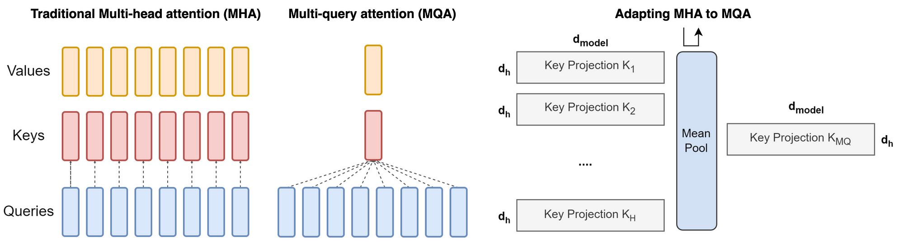

# 什么是 Multi-Query Attention?
---------------------------

- by @karminski-牙医

(image from medium.com/towards-data-science)

多查询注意力（Multi-Query Attention）是 Transformer 解码器的优化版本，通过共享键/值投影来显著降低内存消耗，特别适合自回归生成任务。

### 工作原理

在标准多头注意力基础上进行关键修改：所有注意力头共享同一组键（K）和值（V）的投影矩阵，仅保留查询（Q）的独立投影。公式如下：

$$
\text{MultiQuery}(Q, K, V) = \text{Concat}(\text{head}_1, \ldots, \text{head}_h)W^O
$$

其中每个 $\text{head}_i$ 计算为：

$$
\text{head}_i = \text{Attention}(QW_i^Q, KW^K, VW^V)
$$

$W_i^Q \in \mathbb{R}^{d_{model}\times d_k}$ 保持独立，而 $W^K, W^V \in \mathbb{R}^{d_{model}\times d_k}$ 被所有头共享。

### 核心机制

- **键值共享**：所有注意力头共享同一组 K/V 投影矩阵，仅保留 Q 的独立投影
- **内存优化**：自回归解码时只需缓存单组 K/V 矩阵，显存占用降低为原始 MHA 的 $1/h$

### 优点

- **参数效率**：投影矩阵参数量从 $4hd_kd_{model}$ 降为 $hd_kd_{model} + 2d_kd_{model}$（减少约 75%）
- **解码加速**：KV 缓存量减少 h 倍，在长序列生成（如 2048 tokens）时显著降低内存带宽压力
- **硬件友好**：共享的 K/V 投影产生更规整的内存访问模式，提升 GPU/TPU 利用率

### 缺点

- **容量限制**：共享 K/V 投影削弱了模型对不同表示子空间的捕捉能力，可能影响生成质量
- **训练挑战**：需要更谨慎的参数初始化来补偿表示能力的损失
- **工程复杂度**：共享投影引入跨头依赖，增加分布式计算的同步开销

### 与 MHA/GQA 的对比

| 特性               | Multi-Head (MHA) | Multi-Query (MQA)       | Grouped-Query (GQA)      |
|--------------------|------------------|-------------------------|--------------------------|
| 键值投影共享      | 无               | 所有头共享同一 K/V 投影 | 分组内共享 K/V 投影      |
| 参数量            | $4hd_kd_{model}$ | $(h + 2)d_kd_{model}$  | $(h + 2g)d_kd_{model}$  |
| 解码显存占用      | $2bd_{model}L$   | $2bd_kL$                | $2bgd_kL$               |
| 模型质量          | 最优             | 基线模型 90%-95%        | 接近 MHA (98%-99%)       |
| 典型应用场景      | 预训练          | 低内存推理场景         | 生产环境部署            |

## Refs

[Demystifying GQA — Grouped Query Attention for Efficient LLM Pre-training](https://medium.com/towards-data-science/demystifying-gqa-grouped-query-attention-3fb97b678e4a)
