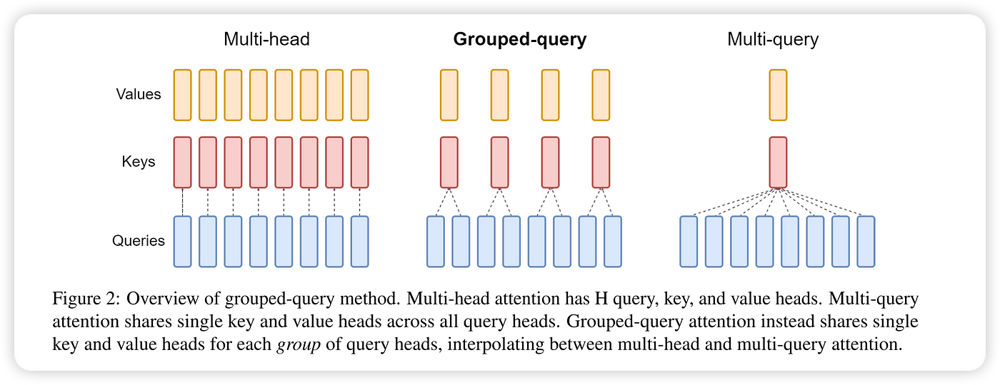

# 什么是 Grouped-Query Attention?
---------------------------

- by @karminski-牙医

 

Grouped-Query Attention（分组查询注意力）是 Transformer 架构的改进型注意力机制，在多头注意力（MHA）和多查询注意力（MQA）之间取得平衡。通过分组共享键值投影，在保持模型容量的同时显著降低计算资源消耗。

### 工作原理

给定输入向量 $Q$（查询）、$K$（键）和 $V$（值），GQA 将查询头分组处理：

$$
\text{GroupedQuery}(Q, K, V) = \text{Concat}(\text{group}_1, \ldots, \text{group}_g)W^O
$$

每个组内共享键值投影：

$$
\text{group}_i = \text{Attention}(QW_i^Q, KW_{\lfloor i/m \rfloor}^K, VW_{\lfloor i/m \rfloor}^V)
$$

其中：
- $g$ 为分组数（通常 $g \ll h$）
- $m = h/g$ 每组包含的头数
- $W_i^Q \in \mathbb{R}^{d_{model}\times d_k}$ 为每组独立的查询投影
- $W_j^K, W_j^V \in \mathbb{R}^{d_{model}\times d_k}$ 为组间共享的键值投影

### 核心机制

- **动态分组策略**：
  - 将 $h$ 个查询头划分为 $g$ 个组
  - 每组包含 $m=h/g$ 个查询头共享同一组键值投影
  - 通过线性投影实现特征空间的分组耦合

- **参数效率**：
  总参数量为：
  $$
  \underbrace{hd_kd_{model}}_{\text{查询投影}} + \underbrace{2gd_kd_{model}}_{\text{键值投影}} = (h + 2g)d_kd_{model}
  $$
  相比 MHA 减少 $3hd_kd_{model} - (h+2g)d_kd_{model}$ 参数

### 优点

- **显存优化**：键值缓存显存占用降至 MHA 的 $g/h$，例如 8 头分组为 2 组时显存减少 75%
- **质量保留**：PaLM 2 实验显示，GQA（g=8）与 MHA 相比在质量指标上差异小于 0.5%
- **灵活扩展**：通过调整分组数 $g$ 实现质量与效率的连续调节：
  - $g=h$ 时退化为标准 MHA
  - $g=1$ 时等价于 MQA

### 缺点

- **分组调优成本**：需要实验确定最佳分组数，不同任务/架构可能有不同最优配置
- **投影偏差风险**：共享键值投影可能限制不同组的特征多样性
- **实现复杂度**：需要管理分组投影的矩阵运算，可能引入额外的张量变换开销

### 性能对比

GQA 论文中使用的T5 Large 和 XXL 模型在多头注意力、5% 训练的 T5-XXL 模型在多查询和分组查询注意力下，在摘要数据集 CNN/Daily Mail、arXiv、PubMed、MediaSum 和 MultiNews，翻译数据集 WMT，以及问答数据集 TriviaQA 上的推理时间和平均开发集性能比较。

| 模型         | 推理时间 (s) | 平均 | CNN  | arXiv | PubMed | MediaSum | MultiNews | WMT  | TriviaQA |
|--------------|--------------|------|------|-------|--------|----------|-----------|------|----------|
| MHA-Large    | 0.37         | 46.0 | 42.9 | 44.6  | 46.2   | 35.5     | 46.6      | 27.7 | 78.2     |
| MHA-XXL      | 1.51         | 47.2 | 43.8 | 45.6  | 47.5   | 36.4     | 46.9      | 28.4 | 81.9     |
| MQA-XXL      | 0.24         | 46.6 | 43.0 | 45.0  | 46.9   | 36.1     | 46.5      | 28.5 | 81.3     |
| GQA-8-XXL    | 0.28         | 47.1 | 43.5 | 45.4  | 47.7   | 36.3     | 47.2      | 28.4 | 81.6     |

## Refs
[GQA: Training Generalized Multi-Query Transformer Models from Multi-Head Checkpoints](https://arxiv.org/pdf/2305.13245)
