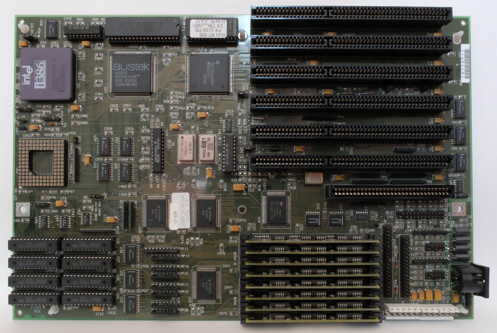

什么是 L1 缓存?
--------------

- by @karminski-牙医

(图片来自 wikipedia)

CPU 的 L1 Cache (一级缓存) 是集成在 CPU 芯片上的高速 SRAM, 用于存储经常访问的数据或指令, 以达到降低访问内存成本的目的. 

如图, 是一个 Intel i386 主板, 其中 L1 Cache 集成到了左上角 CPU 内部, 而左下角的 ISSI 芯片则是 L2 缓存. 

没错, 在这个时代 L2缓存还是外置的. 所以当时 L2 坏掉导致电脑无法启动是很正常的现象. 

## 基本概念

简单来讲 CPU 在内存中读取或写入时, 会检查该位置的数据是否已经在缓存中. 如果存在, 则CPU将从高速缓存中读取或写入, 而不是较慢的主内存. 

那么数据是怎么同步的呢？通常我们把内存和缓存中互相传输的数据分成固定大小, 他们的学名叫做 **cache lines** 或者 **cache blocks**.  

### Cache Entry

**cache line** 从内存复制到缓存时, 会创建一个 **cache entry**, **cache entry** 包含复制的数据和内存位置 (叫做**tag**) . 

### Cache Hit

当CPU需要读取或者写入数据时, CPU先检查 **cache entry** 是否存在, 如果 **cache entry** 的 **tag** (即内存位置)在缓存中, 则意味着缓存命中 **cache hit**, CPU从 **cache entry** 中读取或者写入. 

### Cache Miss

当如果 **cache entry** 的 **tag** 不在缓存中, 则意味着缓存未命中, 即 **cache miss**, CPU 会分配一个新的 cache entry 若缓存已满需根据替换策略淘汰旧条目)  并从内存中读取数据. 然后再从 cache entry 中读取或者写入. 

## ✅ 优点

- 速度比主内存快100倍左右 (AMD 9800x3D 的 L1 访问 latency 是 0.7ns, 使用 DDR5-6200 内存的 latency 是 65.9 ns)
- 降低内存访问功耗
- 缓解冯·诺伊曼瓶颈

## ❌ 局限

- 硅片面积成本高
- 容量限制导致缓存颠簸 (cache thrashing) 
- 一致性维护开销 (MESI协议) 

## 架构差异比较
| 特性        | x86 (Intel Core) | ARM (Cortex-X) | RISC-V (SiFive) |
|-----------|------------------|----------------|-----------------|
| 典型容量     | 32KB+32KB       | 64KB+64KB      | 可配置 (16-128KB)  |
| 关联度      | 8-way           | 2-way L1 指令, 4-way L1 数据          | 2-8 way可选      |
| 替换策略    | LRU             | 伪随机          | 可编程策略        |
| 预取器      | 自适应          | 静态模式        | 可选模块         |
| 延迟       | 4-5 cycles (Intel i7-6700 (Skylake))        | 3 cycles (ARM Cortex-A53)       | 3-5 cycles (SiFive Freedom U740)      |

## Refs

- [Gallery of Processor Cache Effects](https://igoro.com/archive/gallery-of-processor-cache-effects/)
- [CPU Cache](https://en.wikipedia.org/wiki/CPU_cache)
- [Cortex A53 Documents](https://developer.arm.com/documentation/ddi0500/e/level-1-memory-system/about-the-l1-memory-system)
- [Intel i7-6700 (Skylake), 4.0 GHz (Turbo Boost), 14 nm. RAM: 16 GB, dual DDR4-2400 CL15 (PC-19200).](https://www.7-cpu.com/cpu/Skylake.html)
- [Amlogic S905 (ARM Cortex-A53), 1536 MHz, (28 nm). 4 cores. 2 GB DDR3-1824 (13-13-13) (32-bit). ODROID-C2 board.](https://www.7-cpu.com/cpu/Cortex-A53.html)
- [SiFive Freedom U740 (U74 core), 1200 MHz, (28 nm). 4 cores. 16 GB (DDR4). SiFive HiFive Unmatched.](https://www.7-cpu.com/cpu/SiFive_U74.html)
