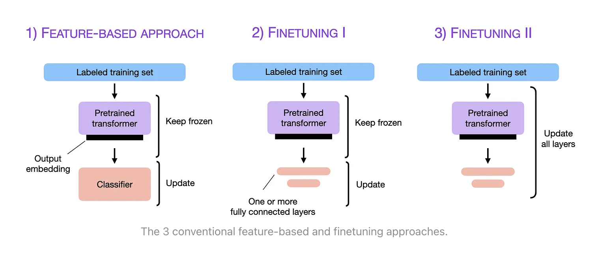

什么是 LLM 微调技术?
-------------------

by @karminski-牙医

LLM 微调 (Fine-tuning) 是一种通过特定领域数据对预训练语言模型进行二次训练的技术。目的是在保持模型通用语言理解能力的基础上，使其适应特定任务或领域。

通过微调技术，基础模型可以显著提升在目标领域（如医疗、法律、金融等）的表现。

## 微调过程

典型微调流程包括以下步骤：
- 选择基础模型：使用预训练好的通用语言模型（如 Qwen、LLaMA 等）作为起点
- 准备领域数据：收集与目标领域相关的标注数据集
- 调整超参数(Hyperparameters)：设置合适的学习率、训练轮次等参数（通常比预训练时更小, 这些都是超参数）
- 领域适应训练：在保持原有参数的基础上，用领域数据继续训练模型
- 评估验证：通过领域特定的评估指标检验微调效果
- 迭代上述过程来获得更好的结果直到满意

## 微调的优点

- 显著提升特定任务/领域表现
- 数据效率高（相比从头训练）
- 计算资源需求相对较少
- 灵活性高（可针对不同场景定制）

## 微调可能存在的问题

- 过拟合风险：过度适配训练数据可能导致泛化能力下降
- 领域依赖：在非目标领域表现可能下降
- 需要领域专业知识：数据准备和评估指标设计需要领域知识
- 计算资源需求：虽然比预训练少，但仍需要可观资源

## 题外话

推荐阅读 ULMFiT 论文（首次提出 NLP 三阶段微调框架）和 BERT 论文的微调章节，这两个工作奠定了现代语言模型微调的基础方法论。

## Refs

- [Universal Language Model Fine-tuning for Text Classification](https://arxiv.org/abs/1801.06146)
- [The Ultimate Guide to LLM Fine Tuning: Best Practices & Tools](https://www.lakera.ai/blog/llm-fine-tuning-guide)
- [Fine-tuning vs Prompt Engineering](https://mlops.community/fine-tuning-vs-prompt-engineering-llms/)
