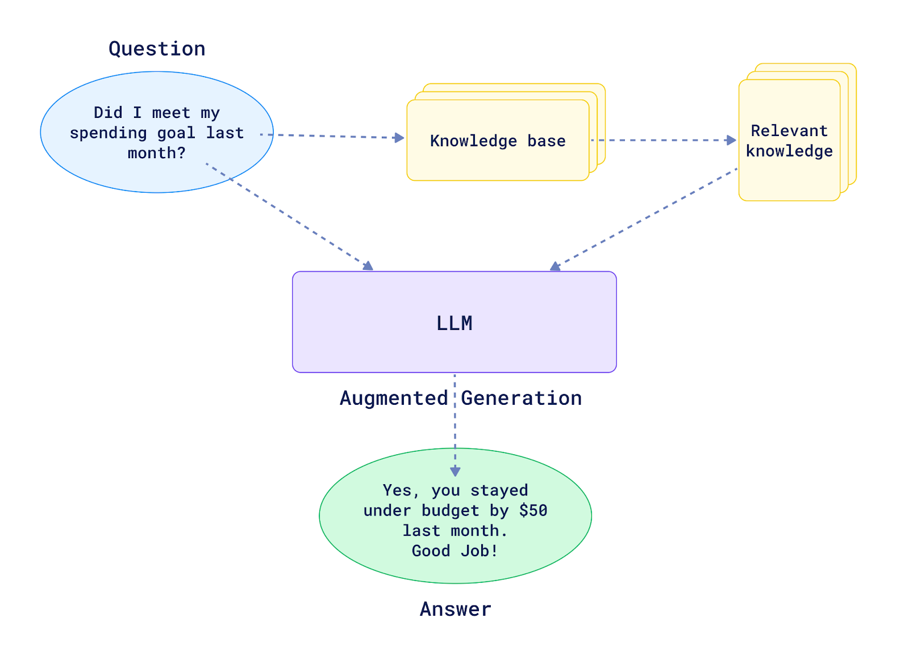

什么是 RAG 技术?
----------------

by @karminski-牙医

(图片来自 qdrant.tech/articles/what-is-rag-in-ai)

RAG (Retrieval-Augmented Generation, 检索增强生成) 是一种结合检索与生成的混合式语言模型技术。

其核心思想是通过外部知识库增强语言模型的生成能力，使模型在回答时能够动态检索相关信息，从而提高生成内容的准确性和事实性。

## RAG 工作流程

典型 RAG 系统包含三个关键阶段：
- **检索阶段**：根据输入问题从外部知识库（如维基百科、专业文档等）检索相关文档片段
- **增强阶段**：将检索到的相关文本与原始问题拼接，形成增强后的输入(即 prompt)
- **生成阶段**：语言模型基于增强后的上下文生成最终回答
这种机制使模型能够突破训练数据的限制，实时获取最新知识。

## RAG 的优点

- 提升事实准确性：通过检索真实数据减少模型"幻觉"
- 动态知识更新：无需重新训练即可更新知识库
- 领域适应性强：通过替换知识库快速适配不同专业领域
- 可解释性增强：可追溯答案的参考来源

## RAG 可能存在的问题

- 检索质量依赖：检索结果的质量直接影响最终生成效果
- 延迟增加：检索步骤会引入额外的计算和IO开销
- 知识更新成本：需要维护高质量且及时更新的知识库
- 上下文长度限制：检索内容可能超出模型上下文窗口

## Refs

[What is RAG (Retrieval-Augmented Generation)?](https://aws.amazon.com/what-is/retrieval-augmented-generation/)
