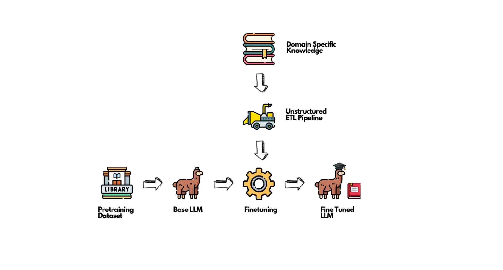

大模型微调最佳实践指南 (超简洁版)
--------------------------------

by @karminski-牙医

(图片来自 unstructured.io)

## 1. 决策阶段（ROI最高）
✅ **建议**：
- 优先使用prompt工程解决简单模式匹配需求 (例如修改文本格式, 大小写转换等)
- 评估是否需要知识更新 → 优先考虑RAG方案
- 确认数据量是否足够（数学推理任务可尝试小一些的数据, 但大量数据带来的优势仍然是显著的）

❌ **不建议**：
- 用微调解决简单响应模式问题（大炮打蚊子）
- 试图通过微调注入新知识 (请使用RAG)
- 在数据量<500条时强行微调

## 2. 数据准备（占80%时间投入）
✅ **建议**：
- 构建多样化样本（覆盖边缘案例）
- 确保输入输出格式明确统一
- 使用LLM生成增强数据
- 按任务类型结构化数据（指令/对话/开放式）

❌ **不建议**：
- 堆砌同质化数据
- 保留未清洗的脏数据
- 忽略数据去重

## 3. 模型选择（中高ROI）
✅ **建议**：
- 优先选择1-13B实用模型（如Llama-3.x-8B）
- 严格检查商业使用许可
- 根据任务复杂度选择尺寸

❌ **不建议**：
- 盲目使用100B+大模型
- 忽略许可证限制
- 为简单任务过度配置

## 4. 评估体系（常被忽视的高ROI）
✅ **建议**：
- 建立量化评估基准
- 对比不同超参数效果
- 定期验证模型退化

❌ **不建议**：
- 仅凭主观感受评估
- 忽略baseline对比
- 训练后不做回归测试

## 5. 微调策略（中ROI）
✅ **建议**：
- 优先尝试LoRA及其变种（DoRA/AdaLoRA）
- 领域适配时结合剪枝+微调
- 使用SGD+学习率调度器

❌ **不建议**：
- 默认使用QLoRA（仅在显存不足时使用）
- 设置过高lora_alpha值（建议从2×rank开始）
- 盲目相信论文报告的训练时间

## 6. 训练优化（技术细节）
✅ **建议**：
- 混合精度+量化节省显存
- 梯度累积模拟大批量
- 定期保存检查点

❌ **不建议**：
- 在单卡上强推大batch_size
- 忽略模型并行化选项
- 训练中断后从头开始

## 7. 资源分配建议
- 80%时间：数据工程
- 15%时间：评估体系构建
- 5%时间：实际训练配置

## 版本注意
- 保持对LoRA生态的跟踪（每月新变种出现）
- 关注Sophia优化器等新进展
- 定期验证不同量化方案效果
