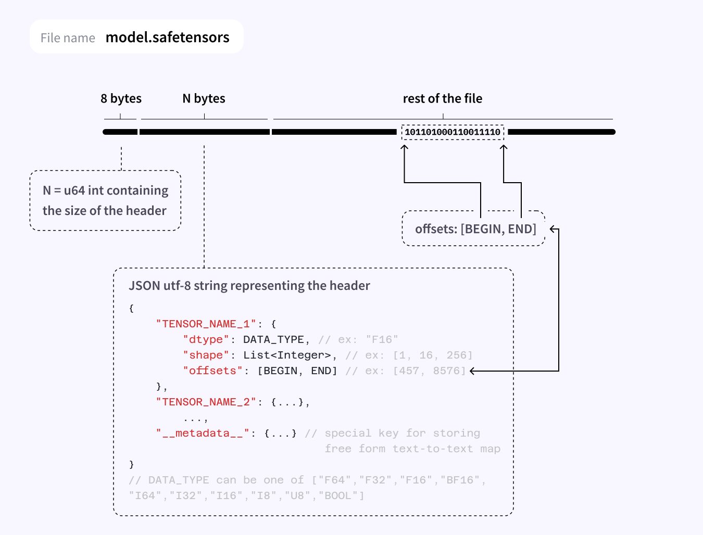

什么是 Safetensors 
----------------

by @karminski-牙医

(图片来自 Hugging Face 官网)

safetensors 是由 Hugging Face 开发的一种安全高效的张量存储格式. 它专为机器学习模型设计, 旨在解决传统序列化格式（如 pickle）的安全漏洞问题, 同时提供更快的加载速度和跨框架兼容性. 

## Safetensors 的主要特点和优势

- **安全性优先：** 彻底解决了 pickle 格式的远程代码执行（RCE）漏洞风险, 通过限制反序列化操作仅加载张量数据, 从根本上杜绝了恶意代码注入的可能性. 
- **快速加载：** 采用零拷贝（zero-copy）技术实现, 在CPU上, 如果文件已缓存, 则可以完全0拷贝（需满足张量连续存储条件）
- **跨框架支持：** 原生支持 PyTorch、TensorFlow、JAX 等主流深度学习框架, 支持多 GPU 设备间的无缝数据共享. 
- **轻量高效：** 文件体积与性能经过优化, 支持与 LZ4/Zstandard 等压缩算法配合使用（注意：格式本身不包含压缩功能）
- **类型安全：** 通过严格的元数据校验确保数据类型和形状的一致性, 避免因类型错误导致的运行时崩溃. 

## Safetensors 的应用

Safetensors 格式已成为现代机器学习生态的重要基础设施：

- **Hugging Face 模型分发：** Hugging Face Hub 的大部分模型默认采用 safetensors 格式分发
- **多框架协作：** 支持在不同深度学习框架间安全共享模型权重
- **生产环境部署：** 被广泛应用于模型服务化（Model Serving）和边缘计算场景

## 哪些框架支持 Safetensors

- [Hugging Face Transformers](https://github.com/huggingface/transformers)
- [Hugging Face Diffusers](https://github.com/huggingface/diffusers)
- [PyTorch](https://pytorch.org/) (通过 `safetensors` 库)
- [TensorFlow](https://www.tensorflow.org/) (通过 `safetensors` 库)
- [JAX](https://jax.readthedocs.io/) (通过 `safetensors` 库)

## Reference

[safetensors](https://huggingface.co/docs/safetensors/index)
