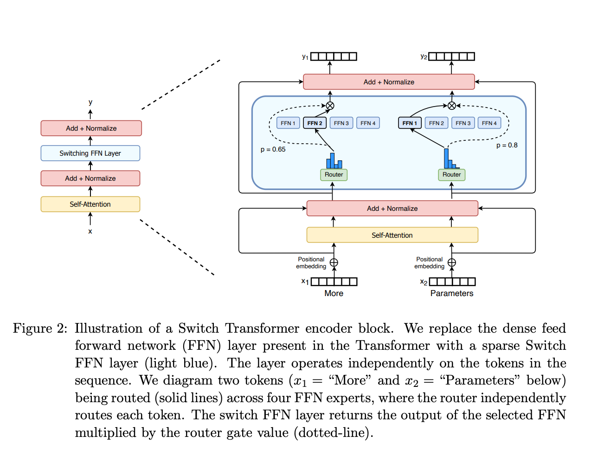

什么是 MoE 模型 
---------------

by @karminski-牙医

MoE (Mixture of Experts, 混合专家模型) 是一种通过组合多个专业子模型 (专家) 来提升模型性能的神经网络架构. 

它通过动态路由机制选择性地激活部分专家, 在保持模型容量的同时显著降低计算成本, 已成为大规模语言模型的重要技术方案. 

典型的 MoE 模型如 DeepSeek-R1, DeepSeek-V3, Mistral 8x7b. 

一些闭源的商业模型可能也是 MoE 架构的 (比如 GPT-4, 相关信息可以参考 [gpt-4-architecture-infrastructure](https://semianalysis.com/2023/07/10/gpt-4-architecture-infrastructure/)).

## MoE 模型的架构

- **门控网络或路由:** 这个部分用于决定哪些令牌 (token) 被发送到哪个专家. 
- **稀疏 MoE 层:** 这些层代替了传统 Transformer 模型中的前馈网络 (FFN) 层. MoE 层包含若干"专家", 每个专家本身是一个独立的神经网络. 

## MoE 模型的主要特点和优势

- **专家系统架构：** 模型由多个独立专家网络 (Expert) 和门控网络 (Gating Network) 组成, 每个专家专注于处理特定类型的输入模式. 
- **稀疏激活机制：** 通过动态路由算法 (如Top-K Gating) , 每个输入样本仅激活少量专家 (比如DeepSeek-R1每个token仅激活8个专家) , 来达到减少计算量的目的. 
- **高效扩展性：** 模型容量可随专家数量线性增长, 而计算成本仅与激活的专家数量相关, 适合构建超大规模模型 (100B+) . 
- **多任务优化：** 不同专家可自发学习不同特征表示, 天然适配多任务学习场景, 在机器翻译、多模态任务中表现突出. 
- **训练稳定性：** 通过负载均衡策略 (如专家容量限制、辅助损失函数) 解决专家利用率不均衡问题, 确保训练过程稳定. 

## MoE 模型面临的挑战

- **需要大量显存：** 需要为每个专家分配显存, 导致需要大量显存. 当然也有一些优化方法, 比如 KTransformers
- **在微调方面存在诸多挑战：** 
  - 微调新任务时可能破坏预训练阶段形成的专家专业化分工
  - 微调数据分布变化可能导致部分专家过拟合, 出现"专家坍缩"现象 (1-2个专家处理90%+的输入) 
- **动态路由优化：** 微调阶段输入分布变化可能导致预训练阶段学习到的路由策略失效

## Reference

- [混合专家模型 (MoE) 详解](https://huggingface.co/blog/zh/moe) 
- [Adaptive Mixture of Local Experts](https://www.cs.toronto.edu/~hinton/absps/jjnh91.pdf)
