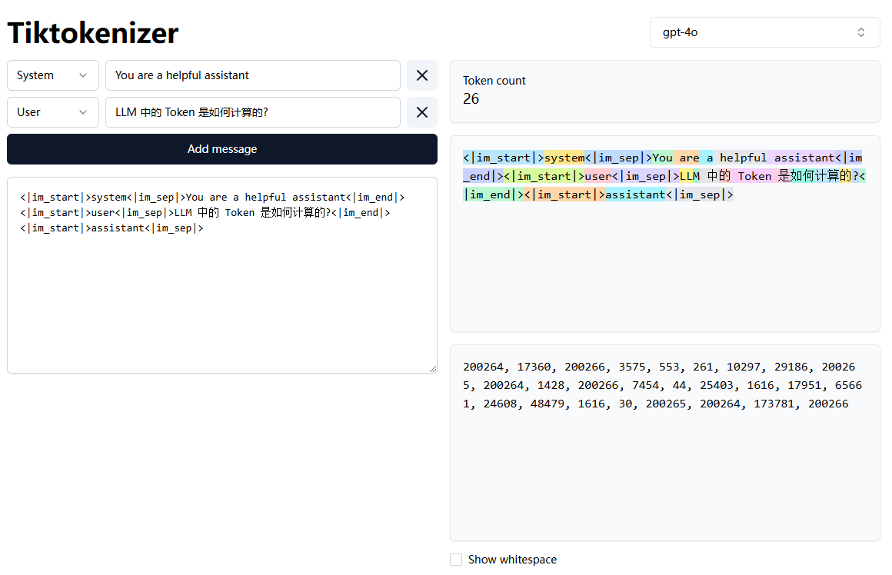

LLM 中的 Token 是如何计算的?
----------------------------

by @karminski-牙医



在大型语言模型 (LLM) 中, Token 是文本处理的基本单元. 

如果是开源模型, 可以在模型仓库中找到 tokenizer.json 文件, 里面包含了词汇表和对应的 token 映射关系. 

其结构类似：

```json
{
  "version": "1.0",
  "added_tokens": [
    {
      "id": 151643,
      "content": "<|endoftext|>",
    },
    ...
  ],
  "model": {
    "type": "BPE",
    "vocab": {
      "!": 0,
      "\"": 1,
      "#": 2,
      "$": 3,
      "%": 4,
      "&": 5,
      ...
    }
  }
}
```

其中:
- added_tokens 表示特殊 token (如开始/结束符)
- model.type 表示分词算法, vocab 表示词汇表, key 是 token, value 是 token 的 id. 


## 常见问题

- **模型是怎样计算 token 使用量的?**  
  1. 预处理：将输入文本标准化 (如 Unicode 规范化) 
  2. 分词：使用 tokenizer 的词汇表进行子词切分
  3. 统计：计算切分后的 token 数量
  4. 特殊 token：添加系统要求的特殊 token (如开始/结束符) 
  
  注意：
  - 不同模型的分词器不同 (GPT 用 BPE, BERT 用 WordPiece 等) 
  - 空格/标点/语言都会显著影响token数量

- **如果使用大模型 API 写了一个服务, 该怎样计算 token 用量?**
  1. 首先可以尝试搜索模型的 tokenizer, 或者看看有没有已经封装好的库 (比如 OpenAI 的 tiktoken)
  2. 如果实在找不到, 可以自己测试一下, 估计一个大概的系数来计算, 比如一个汉字算作 2 个 token 等等

- **模型该怎样与向量数据库结合？**  
  1. 文档分块 (使用 token 计数控制块大小)
  2. Tokenization 处理 (保持与模型使用一致的 token)
  3. 向量化存储 (建议同时存储原始文本和token信息)
  4. 检索时通过向量相似度匹配


## Reference

- [Byte-Pair Encoding tokenization](https://huggingface.co/learn/nlp-course/en/chapter6/5)
- [tiktoken](https://github.com/openai/tiktoken)
- [Understanding LLM Tokenization](https://christophergs.com/blog/understanding-llm-tokenization)
