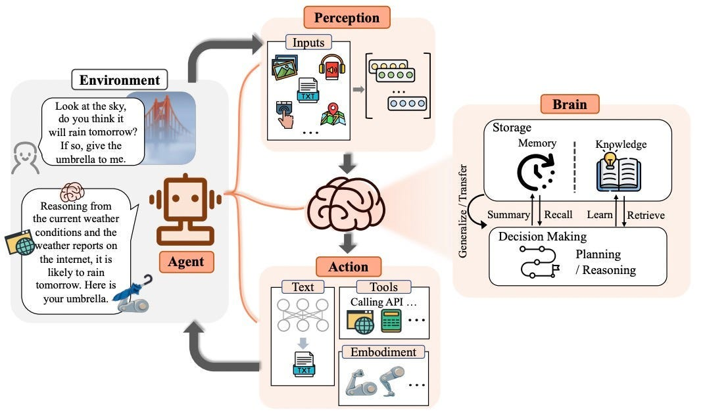
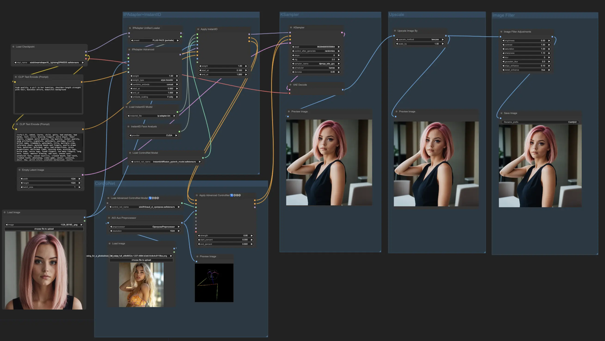
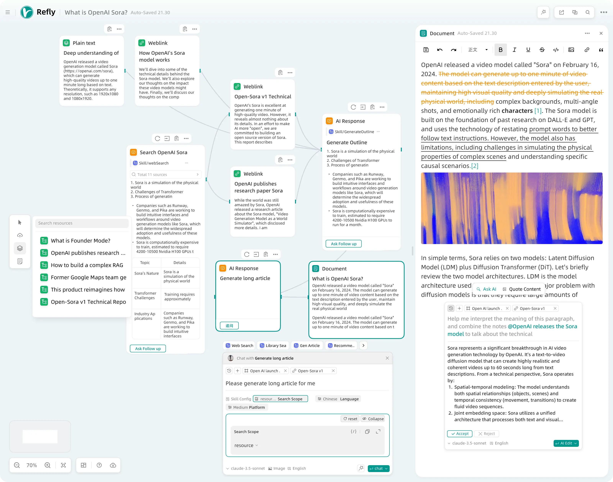

什么是 AI Agent 
---------------

by @karminski-牙医



(image from generativeai.pub)

AI Agent（人工智能代理, 可不是AI特工哦）目前的定义已经很混乱了。但就实际使用来讲 AI Agent 是旨在增强大语言模型，最终达到可以自动完成任务的系统。

AI Agent 一般由大语言模型 (充当大脑), 调度/编排系统 (充当触发器和任务决策), 工具调用 (充当手脚), 记忆与学习 (充当经验), 多模态感知 (充当眼睛和耳朵) 等组成整。

AI Agent 可以是极其简单的 prompt + LLM + 触发器组成, 比如一个中转英的翻译 Agent:

```
请帮我把下面的文本翻译为英文: {text}
```

（text 是用户输入的文本, 会由触发器自动拼进去）

这样一个简单的 prompt 就是一个AI Agent, 用户只要点击这个翻译 Agent 的图标, 进去后在输入框输入文本后点击翻译即可，整个过程不需要任何人工干预。

AI Agent 也可以很复杂, 下图就是 ComfyUI 中将给定人物照片生成另一张人物照片的姿势的 AI Agent:



(图片来自 www.runcomfy.com)


下面则是 refly.ai 中一个给定命题, 自动搜索并生成文章的 AI Agent 的示例:



(图片来自 refly.ai)


