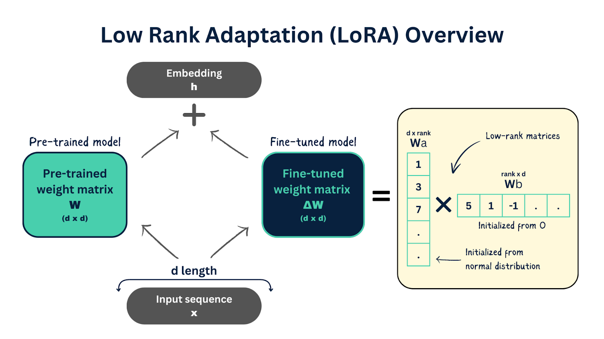

什么是 LoRA
-----------

by @karminski-牙医

(图片来自 Aporia)

LoRA（Low-Rank Adaptation, 低秩自适应）：由微软于 2021 年提出，是一种高效微调大型语言模型（LLM）的技术。

注意区分无线通信领域的 LoRa (Long Range).

它通过在冻结的预训练模型权重旁添加小型可训练的"低秩适应"层，显著降低了微调过程中的计算和内存需求，无需重新训练整个模型。

## LoRA 的工作原理

(如果不知道什么是低秩矩阵, 可以看上一篇内容 [什么是矩阵的秩？什么是低秩矩阵？](../20250227-what-is-rank-in-matrix/what-is-rank-in-matrix.md))

LoRA 基于这样一个假设：模型微调时的权重更新矩阵 ΔW 具有内在的低秩性质。具体推导过程：

1. **传统微调**：假设原始预训练权重矩阵为 $W \in \mathbb{R}^{d \times k}$，其中：
   - d：输入维度（例如 transformer 的 hidden_size）
   - k：输出维度
   全参数微调需要更新整个矩阵，参数量为 $d \times k$

2. **低秩分解**：引入两个更小的矩阵：
   - $W_A \in \mathbb{R}^{d \times r}$（降维矩阵）
   - $W_B \in \mathbb{R}^{r \times k}$（升维矩阵）
   其中秩 r ≪ min(d, k)

3. **更新机制**：将权重更新表示为：  
   $W_{updated} = W + \Delta W = W + W_A \cdot W_B$
   这相当于用低秩矩阵的乘积来近似全秩更新

4. **参数冻结**：原始权重矩阵 W 保持冻结（不更新），只训练 $W_A$ 和 $W_B$

**参数效率分析**：
- 原始可训练参数：$d \times k$（例如 d=1024, k=1024 → 1,048,576 参数）
- LoRA 参数：$r \times (d + k)$（取 r=8 → 8×(1024+1024)=16,384 参数, 参数减少约 64 倍）
- 实际应用中需要权衡：r 值过小可能导致性能下降，r 值过大会降低效率（通常根据模型规模选择 4-128 之间的值）

这种低秩适应有效的深层原因是：模型在不同任务间的知识迁移主要发生在低维子空间，通过调整这些关键方向就能实现高效适应。

## LoRA 的主要特点和优势

- **参数高效：** LoRA 仅训练少量额外参数，而不是完整的模型权重。典型场景下可训练参数减少 10-100 倍（具体取决于原模型尺寸和r值）
- **训练速度快：** 由于需要更新的参数大幅减少，LoRA 微调比全参数微调速度更快，训练时间更短。
- **存储空间小：** LoRA 适配器通常只有几十到几百 MB，而完整的模型可能需要几十 GB。这使得存储和分发多个专门的微调版本变得更加实际。
- **推理性能优化：** LoRA 权重可以在推理前合并回原始模型，不会增加推理时的计算开销。
- **可组合性：** 多个 LoRA 适配器可以被合并或按不同比例混合，创建具有混合能力的模型。
- **质量保持：** 在许多任务中，LoRA 微调的性能与全参数微调相当甚至更好，同时减少了过拟合风险。

## LoRA 的应用

* **个性化模型：** 为特定领域或任务快速创建专门的模型变体。
* **资源受限环境：** 在计算资源有限的环境中实现大型模型的微调。
* **多任务学习：** 为不同任务维护单独的 LoRA 适配器，而不是完整的模型副本。
* **参数高效迁移学习：** 将通用模型快速适配到专业领域（如医疗、法律、金融等）。
* **在线学习：** 持续更新模型以适应新数据，而不需要重新训练完整模型。

但是要注意, 微调更应针对模型能力上的更新, 而不是知识上的更新. 知识上的更新应该交给 RAG 来完成.

总结，LoRA 是一种突破性的微调技术，通过显著降低计算需求和存储成本，使得大型语言模型的个性化和专业化变得更加实用和广泛可行。

随着模型规模不断增长，LoRA 及其变体在 AI 模型部署和适配中的重要性将继续提升。

## 支持 LoRA 的框架

* [PEFT](https://github.com/huggingface/peft) (由 Hugging Face 开发的参数高效微调库)
* [unsloth](https://github.com/unslothai/unsloth) (高效微调框架，显存需求可低至5GB, DeepSeek 几个量化模型的流行版本全是 unsloth 团队的)
* [LLaMA-Factory](https://github.com/hiyouga/LLaMA-Factory) (用于LLaMA系列模型的流行微调框架)

## Reference

* [LoRA: Low-Rank Adaptation of Large Language Models](https://arxiv.org/abs/2106.09685)
* [Low-Rank Adaptation: A Closer Look at LoRA](https://www.aporia.com/learn/low-rank-adaptation-lora/)
* [This conceptual guide gives a brief overview of LoRA](https://huggingface.co/docs/peft/main/en/conceptual_guides/lora)
* [Efficient Fine-Tuning of LMs with Low-Rank Adaptation](https://www.databricks.com/blog/efficient-fine-tuning-lora-guide-llms)
