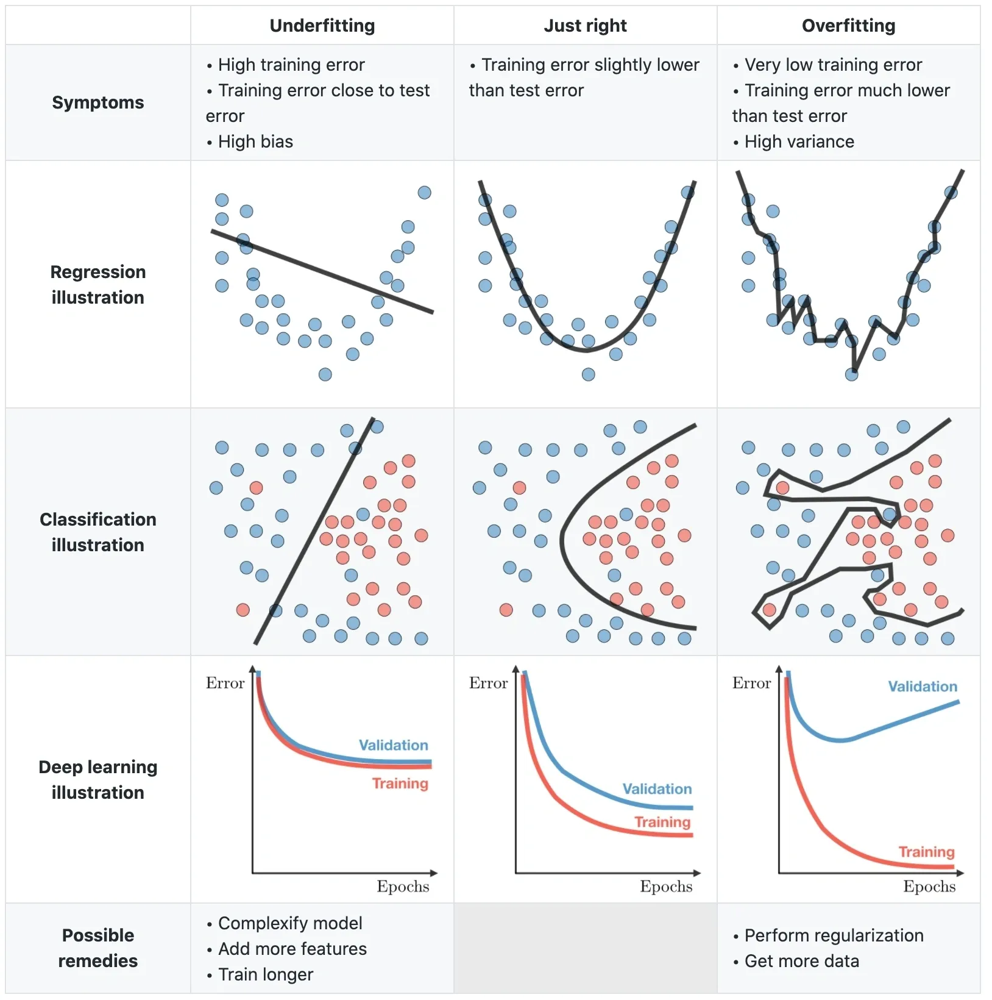

什么是拟合与过拟合？
-------------------------
- by @karminski-牙医

  
(图片来自 arockialiborious.com)

拟合（Fitting）是机器学习中让数学模型**贴合观测数据**的过程。就像根据身材定制衣服，好的拟合需要平衡**贴合度（Goodness of Fit）**与**泛化能力（Generalization）**：

- **贴合度**：模型对训练数据的解释能力（如衣服的合身程度）
- **泛化能力**：模型对新数据的预测能力（如衣服对不同体型的适应性）
- **平衡艺术**：完美贴合训练数据 ≈ 100%定制服装，但可能无法适应新体型

## 拟合的本质
- **数学定义**：寻找函数 $f(x)$ 使得 $f(x_i) \approx y_i$（$i=1,...,n$）
- **核心矛盾**：模型容量与数据复杂度
- **关键指标**：训练误差（Training Error） vs 测试误差（Test Error） vs 验证误差（Validation Error）

## 欠拟合：当模型不够聪明
欠拟合（Underfitting）是模型**无法捕捉数据基本模式**的现象：
- **典型特征**：训练误差和测试误差都较高
- **危险信号**：模型忽略明显的数据趋势
- **经典案例**：用线性模型拟合正弦波数据

## 过拟合：当聪明反被聪明误
过拟合（Overfitting）是模型**完美记忆训练数据**却失去泛化能力的现象：
- **典型特征**：训练误差趋近于0，测试误差突然上升
- **危险信号**：模型开始拟合噪声和异常值
- **经典案例**：用10次多项式拟合10个数据点

## 拟合程度对比表
| 特征          | 欠拟合               | 适度拟合             | 过拟合                 |
|-------------|-------------------|------------------|---------------------|
| 模型复杂度      | 过低                | 匹配数据复杂度         | 过高                 |
| 训练误差       | 高                | 低               | 趋近于0              |
| 测试误差       | 高                | 低               | 突然升高              |
| 数据利用效率    | 浪费信息            | 有效提取模式         | 记忆噪声              |
| 典型解决方法    | 增加模型复杂度        | ——               | 正则化/早停/数据增强     |

## 数学视角

### 1. 优化目标
给定数据集 $(X,y)$，拟合过程可表示为：
$$\min_{\theta} \frac{1}{n}\sum_{i=1}^n L(f_\theta(x_i), y_i) + \lambda R(\theta)$$
其中：
- $L$ 为损失函数（如MSE/交叉熵）
- $R(\theta)$ 为正则化项（L1/L2正则）
- $\lambda$ 为正则化系数

### 2. 偏差-方差权衡
泛化误差可分解为：
$$\mathbb{E}[(y-\hat{f})^2] = \underbrace{(\mathbb{E}[\hat{f}] - f)^2}_{\text{Bias}^2} + \underbrace{\mathbb{E}[(\hat{f}-\mathbb{E}[\hat{f}])^2]}_{\text{Variance}} + \sigma^2$$
- **高偏差**：模型过于简单（欠拟合）
- **高方差**：模型过于复杂（过拟合）
- **黄金平衡**：通过调整模型复杂度找到最小总误差点

过拟合发生时，模型满足：
$$\mathbb{E}[L_{train}] \ll \mathbb{E}[L_{test}]$$ 
即训练误差显著小于测试误差。

## Refs

* [Underfitting vs Overfitting](https://arockialiborious.com/f/underfitting-vs-overfitting)
* [Wikipedia: Overfitting](https://en.wikipedia.org/wiki/Overfitting)
