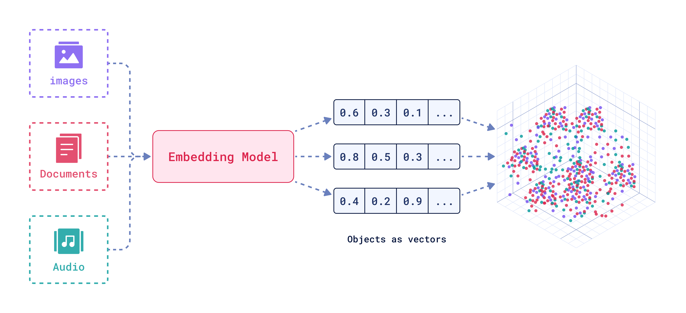

什么是向量嵌入?
----------------

by @karminski-牙医

(图片来自 qdrant.tech)

向量嵌入（Vector Embeddings）是将复杂数据（如文本、图像、音频等）转换为密集数值向量的过程和结果。这些向量通常是高维的数字数组，使机器能够"理解"数据间的语义关系。

其核心思想是通过数学表示捕捉原始数据的语义信息，将抽象概念映射到多维空间，这样语义空间的相似性，就可以转化为向量空间中的接近性(数学问题)。

## 向量嵌入工作流程

典型的向量嵌入过程包含三个关键阶段：
- **特征提取**：从原始数据（文本、图像等）中识别和提取关键特征
- **向量化转换**：将提取的特征通过神经网络映射到高维向量空间
- **维度处理**：根据需要进行降维或标准化，优化向量表示

这种机制使计算机能够以数学方式处理和"理解"复杂的非结构化数据。

## 向量嵌入的优点（针对数据库场景）

- **稠密表示**：相比传统稀疏向量（如TF-IDF）更节省存储空间
- **相似性保持**：原始数据相似性在向量空间得以保留（余弦相似度≈语义相似度）
- **跨模态统一**：允许文本/图像/视频在同一空间进行联合检索
- **索引友好**：适合HNSW、IVF-PQ等近似最近邻算法加速
- **增量更新**：支持新数据嵌入无需重建整个向量空间

## 向量嵌入可能存在的问题（数据库视角）

- **维度膨胀**：维度特别多的向量会显著增加存储和内存消耗
- **距离失真**：降维处理可能破坏原始空间关系
- **版本漂移**：不同模型版本生成的向量不可直接比较
- **冷启动**：空数据库阶段难以建立有效索引结构
- **精度衰减**：量化压缩（如int8）导致的检索精度损失

## 核心应用场景

- **混合搜索**：结合元数据过滤与向量相似性检索（如语义搜索）
- **内容去重**：通过向量距离识别重复/相似内容
- **智能推荐**：基于用户行为向量的实时物品匹配（兴趣相似度计算）
- **时序分析**：追踪向量漂移模式（用户兴趣/内容热点的演化分析）
- **知识管理**：RAG系统中的高效知识检索与上下文关联
- **聚类分析**：自动发现数据中的潜在模式和分组结构
- **缓存优化**：高频查询结果的向量空间缓存加速

## Refs
- [What are Embeddings?](https://qdrant.tech/articles/what-are-embeddings/)
- [Understanding Vector Embeddings](https://www.pinecone.io/learn/vector-embeddings/)

