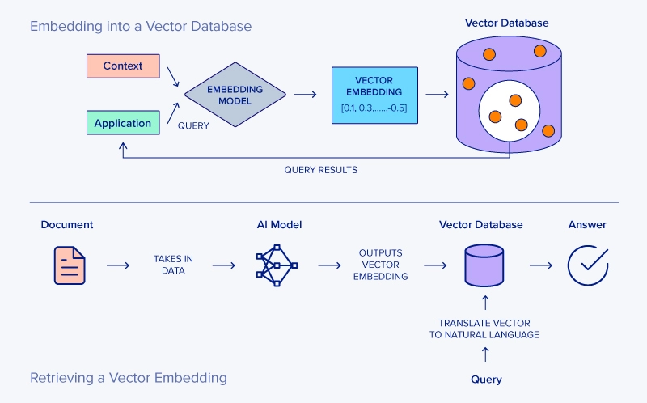

什么是向量数据库?
----------------

- by @karminski-牙医

(图片来自 www.exxactcorp.com)

向量数据库（Vector Database）是一种专门设计用于存储、管理和搜索 [向量嵌入（vector embeddings）](./20250307-what-is-vector-embedding/what-is-vector-embedding.md) 的数据库系统。

其核心价值在于能够高效执行相似性搜索（similarity search），支持AI应用中常见的"寻找最相似内容"需求，成为现代人工智能基础设施的重要组成部分。

## 向量数据库的工作原理

向量数据库的核心功能围绕以下几个关键环节：
- **向量嵌入存储**：将文本、图像等内容通过嵌入模型转换为高维数字向量并存储
- **相似性检索**：使用近似最近邻（ANN）算法实现高效搜索，支持余弦相似度、内积、欧式距离等多种度量方式
- **索引机制**：通过HNSW（分层可导航小世界图）实现快速导航，或IVF（反向文件索引）进行聚类加速
- **元数据过滤**：支持在相似性搜索中结合传统数据库的过滤条件（如时间范围、类别标签）

这种设计使向量数据库能在毫秒级别内从数百万甚至数十亿向量中找出最相似项。

## 向量数据库的优势

- **高效相似性搜索**：通过ANN算法实现O(log n)时间复杂度，比传统数据库的精确搜索O(n)快很多
- **混合查询能力**：可同时处理"找到与这张图片相似且价格低于100元的产品"这类复合查询
- **AI应用集成**：特别适合实现[RAG架构](./20250309-what-is-rag/what-is-rag.md)中的长期记忆模块
- **规模可扩展性**：支持海量向量数据的存储和检索
- **多模态支持**：同时处理文本、图像、音频等不同类型的嵌入向量
- **实时性能**：支持高并发、低延迟的查询操作

## 向量数据库可能存在的挑战

- **精度与速度权衡**：更高精度通常意味着更慢的查询速度
- **资源消耗**：高维向量索引可能需要大量内存
- **嵌入质量依赖**：搜索结果质量很大程度上取决于输入嵌入的质量
- **维度诅咒**：随着向量维度增加，搜索效率可能下降
- **复杂调优需求**：最佳性能可能需要专业知识进行参数调优

## 常见向量数据库产品

- **Chroma**：为AI应用设计的嵌入式向量数据库
- **Pinecone**：全托管式向量数据库服务
- **Weaviate**：开源向量搜索引擎
- **Milvus**：开源分布式向量数据库
- **Qdrant**：高性能向量相似度搜索引擎
- **FAISS (Facebook AI Similarity Search)**：需注意这是算法库而非完整数据库（通常需配合其他存储系统使用）
- **PGVector**：PostgreSQL 的向量扩展，由于 Postgres 性能很强, 因此支持的维度特别高

## Refs

- [Understanding Vector Databases](https://www.pinecone.io/learn/vector-database/)
- [Vector Databases Explained](https://www.databricks.com/glossary/vector-database)
