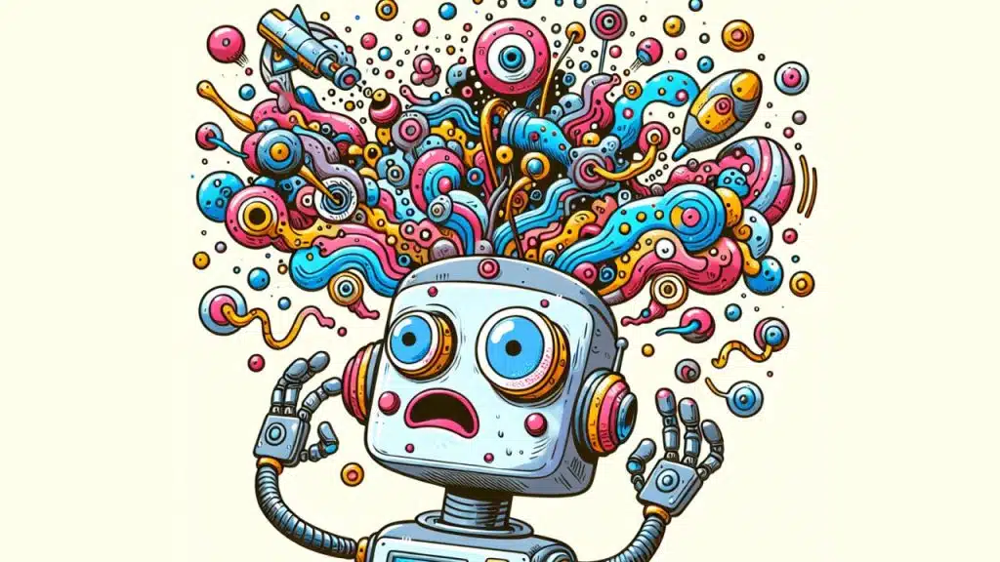

# 什么是 AI 幻觉?
----------------

by @karminski-牙医

(图片来源：team-gpt.com)

AI 幻觉 (AI Hallucination) 是指人工智能模型生成的看似合理但实际上不准确、虚构或与事实不符的内容。

这种现象在生成式 AI 中普遍存在，模型会以高度自信的姿态输出错误信息，以我的经验, 务必对AI生成的任何数值内容保持足够的警惕。

## 幻觉产生机制

AI 幻觉的核心产生机制包含三个关键环节：
- **模式匹配驱动**：基于统计规律而非事实理解生成文本
- **知识边界模糊**：无法区分训练数据中的事实与虚构内容
- **置信度错位**：流畅的表达形式与内容准确性脱钩
  
这种机制导致模型可能将不同领域的知识片段进行不合理组合。

## 主要表现形式
- **事实扭曲**：篡改真实事件的时间、地点等关键要素
- **学术造假**：虚构不存在的论文、实验数据和学术概念
- **逻辑断裂**：在连续对话中出现自相矛盾的陈述
- **过度泛化**：将特定场景的规律错误推广到其他领域

## 技术局限性
- **数据依赖困境**：输出质量受限于训练数据的时效性和完整性
- **概率生成本质**：优先选择统计上合理而非事实正确的表达
- **验证机制缺失**：缺乏实时的事实核查和逻辑自检能力
- **上下文敏感度**：长对话中错误信息可能被反复强化

## 缓解方案
- **混合架构**：结合检索增强（RAG）与生成模型
- **置信度校准**：输出时附带准确性概率评估
- **溯源机制**：标注生成内容的参考来源
- **动态修正**：建立实时反馈的错误修正回路

## Refs

- [Understanding the AI Hallucination Phenomenon](https://team-gpt.com/blog/ai-hallucination/)
