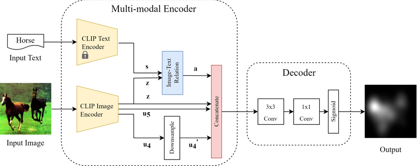

什么是模态编码？
----------------

by @karminski-牙医

(图片来自 researchgate.net)

模态编码（Modal Encoding）是处理多模态数据时，将原始数据转换为特定模态特征 (可以理解为一种统一格式) 表示的过程。其核心目标是保留数据模态特性，同时提取机器可理解的语义特征。

## 核心原理

模态编码典型处理流程包含：
- **信号预处理**：将原始数据转换为标准格式
  - 图像：归一化/尺寸调整
  - 文本：分词/词干提取
  - 音频：分帧/频谱转换
- **特征提取**：使用模态专用编码器
  - 视觉：CNN/ViT提取空间特征
  - 文本：BERT/GPT提取语义特征
  - 音频：HuBERT/Mel-Frequency特征提取
  - 3D点云: ULIP-2提取特征
- **表示优化**：通过池化/注意力机制获得紧凑表示

## 技术优势（系统实现视角）

- **特征解耦**：允许不同模态独立优化编码器
- **并行处理**：各模态编码可分布式执行
- **硬件适配**：为特定模态选择最优计算单元（如GPU加速图像编码）
- **缓存复用**：编码结果可离线预计算存储
- **渐进增强**：支持编码器单独升级替换

## 实现挑战（工程化角度）

- **计算异构**：不同模态编码器的资源需求差异
- **时序同步**：流式场景下的多模态对齐难题
- **模态偏差**：编码器过拟合特定数据分布
- **特征膨胀**：高维特征带来的存储压力
- **版本控制**：编码器更新导致的特征空间漂移

## 与向量嵌入的区别

| 维度         | 模态编码                      | 向量嵌入                      |
|--------------|-----------------------------|-----------------------------|
| **处理阶段**  | 多模态处理前端                 | 跨模态对齐后端                |
| **输入数据**  | 原始信号（像素/声波/字符）      | 模态编码输出的特征表示         |
| **输出特性**  | 保留模态特性的特征图/序列       | 扁平化的跨模态可比向量         |
| **优化目标**  | 最大化模态内信息保留           | 最小化跨模态语义距离           |
| **可解释性**  | 高（对应具体感知特征）          | 低（抽象语义表示）             |
| **典型操作**  | 卷积/池化/词干提取             | 线性投影/注意力融合            |

**协同工作示例**（图像-文本场景）：
1. 图像通过CNN编码 → 输出14×14×512特征图（空间感知特征）
2. 文本通过BERT编码 → 输出768维词向量序列（语法语义特征）
3. 两者分别通过向量嵌入层 → 统一为1024维语义向量
4. 在共享空间计算余弦相似度实现图文匹配 (这里使用余弦相似度的优点包括不受向量绝对大小影响只关注方向, 以及输出范围固定在[-1, 1]易于最后概率化处理)

这种分层设计既保留了模态特异性（编码阶段），又实现了跨模态交互（嵌入阶段），是当前多模态系统的典型架构范式。

## Refs
- [modality-encoder-in-multimodal-large-language-models](https://adasci.org/modality-encoder-in-multimodal-large-language-models)
