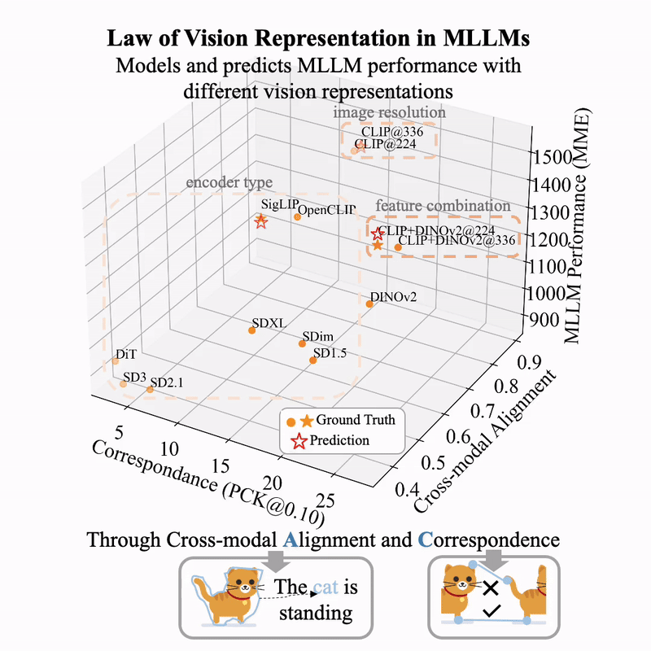

什么是表示空间？
----------------

by @karminski-牙医



(图片来自 huggingface.co/blog/Borise/law-vision-representation-in-mllms)

表示空间 (Representation Space) 是多模态人工智能中的核心概念，指不同模态数据（文本、图像、音频等）经过编码后映射到的统一数学空间。该空间使机器能够理解跨模态的语义关联，是实现多模态智能的数学基础。


## 核心定义

表示空间本质上是**高维向量空间**，具有以下关键属性：
- **跨模态可比性**：不同模态数据在空间中的距离反映语义相似度
- **线性组合性**：支持语义向量运算（如 v_程序员 - v_代码 + v_绘画 ≈ v_画家）
- **层次语义**：不同维度对应不同抽象级别的特征（低层纹理→高层语义）


## 技术实现

### 构建方法
```python
# 以对比学习为例
image_encoder = VisionTransformer()  # 视觉编码器
text_encoder = TextTransformer()     # 文本编码器

# 映射到统一空间
img_emb = image_encoder(img)  # [batch_size, d]
txt_emb = text_encoder(text)  # [batch_size, d]

# 对比损失计算
similarity = (img_emb @ txt_emb.T) * temperature  # 计算图像-文本相似度矩阵
loss = cross_entropy(similarity, labels)          # 对角线为正样本，其余为负样本, 使模型学习跨模态对齐
```

### 数学特性
- **度量学习**：定义距离函数 $d(v_i, v_j) = 1 - \frac{v_i \cdot v_j}{\|v_i\|\|v_j\|}$
- **流形假设**：同类数据在空间中形成连续流形（如所有"狗"图像构成子空间）
- **注意力兼容**：支持跨模态注意力计算 $Attention(Q_{text}, K_{image}, V_{image})$


## 应用场景

- **跨模态检索**：`text_emb = encode("火山喷发")` → 查找 `argmin(d(v_img, text_emb))`
- **特征融合**：`[img_emb; audio_emb] → 融合层 → 联合表示`
- **零样本学习**：通过prompt工程 `v_"医疗报告" + v_CT影像 → 诊断建议`
- **内容生成**：文本引导的图像编辑 `v_原图 + v_"添加彩虹" → 生成新图`


## 实现挑战

- **模态鸿沟**：不同模态特征分布差异（如图像特征的L2范数通常大于文本）
- **维度灾难**：随着维度增加，数据稀疏性导致相似度度量可靠性下降
- **语义泄漏**：图像背景纹理等无关特征被编码到语义维度
- **评估困境**：缺乏客观的几何语义评估指标


## Refs
- [CLIP: Connecting text and images](https://openai.com/index/clip/)
