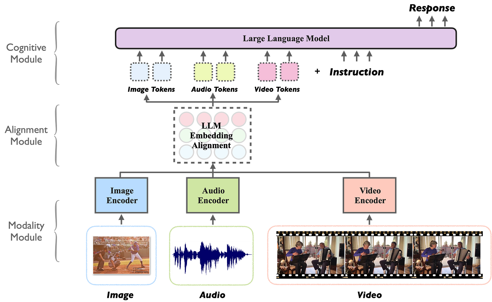

什么是多模态模型？
----------------

by @karminski-牙医

(图片来自 medium.com/@tenyks_blogger)

多模态模型（Multimodal LLM）是能够同时处理和关联多种数据模态（如文本、图像、音频、视频等）的大语言模型。这类模型通过统一表示空间，实现跨模态的语义理解和内容生成。

## 核心工作原理

多模态模型的工作机制包含三个关键阶段：
- **[模态编码](../20250315-what-is-modal-encoding/what-is-modal-encoding.md)**：使用专用编码器（CNN/ViT处理图像，BERT处理文本等）提取各模态特征
- **特征对齐**：通过交叉注意力机制（cross-attention）建立细粒度跨模态关联（如图像区域与文本描述的对应关系）
- **联合推理**：在共享[表示空间](../20250316-what-is-representation-space/what-is-representation-space.md)中进行跨模态信息融合与语义推理

## 技术优势（系统实现视角）

- **统一接口**：支持自然语言作为跨模态交互的统一接口
- **知识迁移**：视觉-语言等跨模态知识的相互增强
- **上下文扩展**：能同时利用多模态上下文信息（如文本描述+示意图）
- **数据效率**：通过多任务学习提升小样本场景表现
- **灵活部署**：架构灵活性：支持级联式（冻结编码器+可训练适配器）或端到端联合训练架构 (不同模态流程整合到单一神经网络中的架构)

## 实现挑战（工程化角度）

- **计算复杂度**：多模态并行处理带来的显存/算力压力
- **对齐噪声**：跨模态数据标注的噪声会影响注意力机制
- **模态鸿沟**：不同模态特征分布的差异导致融合困难
- **延迟累积**：级联架构中各组件（如图像编码器+LLM）的推理延迟叠加问题
- **评估困境**：现有基准（如MMLU、MMBENCH）难以全面评估跨模态推理能力

## Refs
- [A Survey on Multimodal Large Language Models](https://arxiv.org/abs/2306.13549)
- [LLaVA: Large Language and Vision Assistant](https://llava-vl.github.io/)
