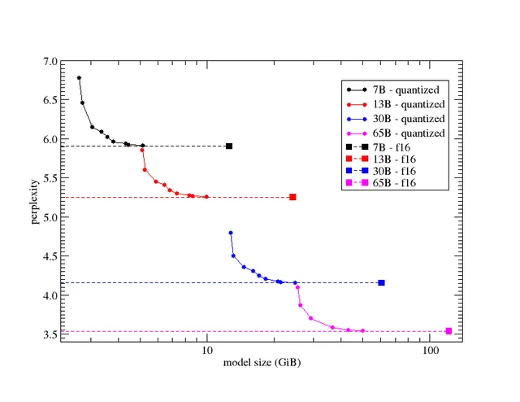

什么是 LLM 的困惑度 (Perplexity)
-------------------------------

by @karminski-牙医

困惑度（Perplexity）是评估语言模型（LLM）性能的关键指标。它衡量模型在预测文本序列时的不确定性程度，用于量化模型对未见过的数据的预测能力。

## 困惑度的定义与计算

* **数学定义：** 困惑度是模型对测试集的对数概率的负平均值。数学上表示为：
  $$\text{Perplexity} = \exp\left(-\frac{1}{N}\sum_{i=1}^{N}\log p(x_i)\right)$$
  其中 N 是测试集中的标记数量，p(x_i) 是模型对标记 x_i 的预测概率。

* **直观理解：** 困惑度可以理解为模型在每个位置上平均需要考虑的可能选项数量。困惑度越低，说明模型的预测准确性越高。

* **熵的关系：** 困惑度是序列交叉熵的指数，直接反映了模型预测的不确定性。

## 困惑度的重要意义

* **模型评估：** 困惑度提供了一种客观的方式来比较不同语言模型的性能，是训练过程中的重要监控指标。通常微调或者量化过程中也会使用。

* **过拟合检测：** 通过比较训练集和验证集上的困惑度，可以发现模型是否过拟合。

* **预测质量：** 较低的困惑度通常意味着模型能够生成更流畅、更连贯的文本。

* **领域适应性：** 困惑度可以反映模型在特定领域文本上的表现，帮助评估模型的领域迁移能力。

## 困惑度的使用场景

困惑度广泛应用于各种 LLM 相关的场景：

* **模型训练：** 作为训练过程中的优化目标和停止条件。

* **模型选择：** 帮助研究人员在不同架构和参数设置之间做出选择。

* **数据质量评估：** 高质量的训练数据通常会导致模型在相似数据上具有较低的困惑度。

* **生成文本评估：** 虽然不是唯一指标，但困惑度可以作为生成文本质量的参考。

## 困惑度的局限性

尽管困惑度广泛使用，但它也存在一些局限性：

* **不完全反映语义理解：** 低困惑度不一定意味着模型真正理解了文本的语义。

* **对于开放式生成任务不够全面：** 在创意写作等任务中，困惑度可能无法完全捕捉输出的质量。

* **与人类评价不完全一致：** 困惑度是一个统计指标，可能与人类对文本质量的主观评价存在差异。

* **模型大小的影响：** 大型模型往往能够达到较低的困惑度，但这并不总是转化为更好的实际应用效果。

总之，困惑度是评估 LLM 性能的重要指标，提供了一种客观测量模型预测能力的方法。然而，它应该与其他评估方法结合使用，以全面了解模型的实际性能。

## 支持困惑度评估的工具

- [HuggingFace Evaluate](https://huggingface.co/docs/evaluate/index)

## Reference

- https://en.wikipedia.org/wiki/Perplexity
- https://huggingface.co/docs/transformers/perplexity
