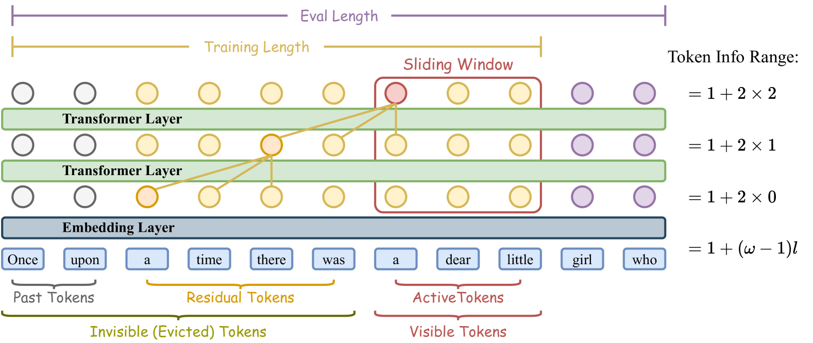

什么是 Sliding Window Attention 
-------------------------------

by @karminski-牙医

  
*图：Transformer中的滑动窗口注意力机制示意图（来源：arXiv 2502.18845v1）*

[Sliding Window Attention](https://arxiv.org/html/2502.18845v1)（滑动窗口注意力）是一种用于提升大型语言模型长文本处理效率的注意力机制. 它通过限制每个token的注意力范围, 将Transformer的计算复杂度从平方级（O(n²)）降低到线性级（O(n)）, 同时保持对长距离依赖的捕捉能力. 

简单来讲, 在推理引擎中应用 SWA 可以显著降低长上下文的显存消耗. 

## SWA 的核心原理与优势

* **局部注意力窗口**：  
  每个token只关注固定窗口大小（如4096 tokens）内的上下文, 而非整个序列. 如图1所示, 窗口会随着处理位置滑动, 形成连续的上下文覆盖. 

* **线性计算复杂度**：  
  传统Transformer的注意力计算量随序列长度呈平方增长, SWA通过固定窗口大小实现线性增长, 使处理万级token的文本成为可能. 

* **信息接力机制**：  
  采用sigmoid激活函数替代softmax（SWAT改进）, 结合平衡的ALiBi位置编码, 使模型能通过滑动窗口逐层传递上下文信息, 解决传统SWA的"注意力下沉"问题. 

* **训练-推理一致性**：  
  通过Sliding Window Attention Training（SWAT）框架, 在训练阶段就采用窗口化注意力, 消除传统方法中训练全注意力与推理局部注意力的差异. 

* **硬件友好性**：  
  固定窗口大小更适合GPU的并行计算特性, 配合内存映射（mmap）技术可实现快速加载, 相比传统Transformer推理速度提升3-5倍. 

## SWA 的实际应用

* **长文档处理**：  
  处理整本书籍（如PG-19数据集）、法律文档等超长文本时, 显存占用保持稳定. 实验显示在16k tokens长度下, 困惑度（perplexity）仅上升0.15

* **实时对话系统**：  
  在持续对话场景中, 采用动态窗口滑动策略, 只保留最近N轮对话的注意力上下文, 避免历史信息累积导致的性能下降

## 支持 SWA 的实践框架

- [llama.cpp](https://github.com/ggml-org/llama.cpp/pull/13194)
  刚刚合并 SWA 支持的 PR

- [flash-linear-attention](https://github.com/Fzkuji/flash-linear-attention)  
  提供CUDA优化的SWA实现, 支持多GPU并行训练

- [nanoGPT](https://github.com/karpathy/nanoGPT)  
  新增SWA训练模式, 可在消费级GPU上训练10B级长文本模型

## 参考文献
- 核心论文：https://arxiv.org/abs/2502.18845v1  
- 技术解析：https://klu.ai/glossary/sliding-window-attention
